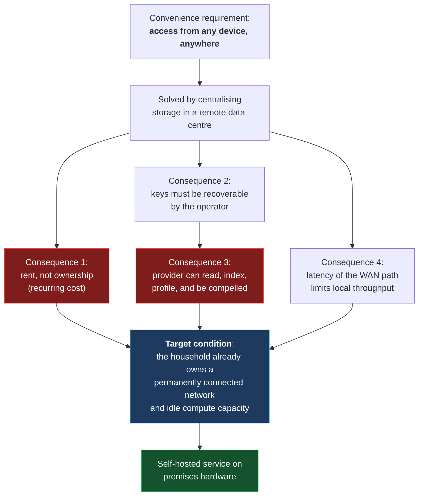
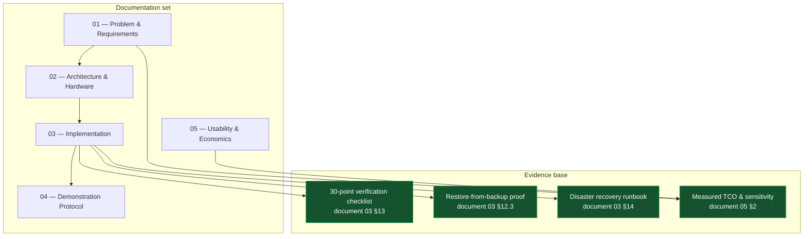

# 01 — Overview & Problem Statement

> [!abstract] Project summary
> `PI-CLOUD` replaces a recurring consumer-cloud subscription stack with a
> self-hosted Raspberry Pi 5 private cloud. The system is built from open-source
> components only (Raspberry Pi OS, Docker, CasaOS, Nextcloud, Jellyfin), costs
> approximately **₹16,500 / USD 186 one-time** and **≈ ₹38 / USD 0.50 per month**
> to run, and keeps all user data inside the physical premises with
> **per-user server-side encryption** and **no inbound network exposure**.

**Document 1 of 5** · 01 Problem · 02 Architecture · 03 Implementation · 04 Demonstration · 05 Usability

---

## Contents

1. [[01-Overview-and-Problem#1. Problem statement|1. Problem statement]]
2. [[01-Overview-and-Problem#2. Quantified problem analysis|2. Quantified problem analysis]]
3. [[01-Overview-and-Problem#3. Root-cause analysis|3. Root-cause analysis]]
4. [[01-Overview-and-Problem#4. Proposed solution|4. Proposed solution]]
5. [[01-Overview-and-Problem#5. Requirements|5. Requirements]]
6. [[01-Overview-and-Problem#6. Scope boundaries|6. Scope boundaries]]
7. [[01-Overview-and-Problem#7. Feasibility assessment|7. Feasibility assessment]]
8. [[01-Overview-and-Problem#8. Evaluation criteria & success metrics|8. Evaluation criteria]]
9. [[01-Overview-and-Problem#9. Risks & limitations|9. Risks & limitations]]
10. [[01-Overview-and-Problem#10. Evaluation map — where each claim is evidenced|10. Evaluation map]]
11. [[01-Overview-and-Problem#11. Terminology|11. Terminology]]
12. [[01-Overview-and-Problem#12. Conclusions|12. Conclusions]]

---

## 1. Problem statement

> [!important] Statement of the problem
> A typical household stores its files — photographs, academic records, medical
> documents, identification papers — in third-party consumer cloud services that
> charge recurring fees, retain the right to read the data, and can restrict or
> remove access unilaterally. The household simultaneously operates a
> permanently connected broadband line and already owns computing hardware. The
> result is a structurally avoidable arrangement: **a rental payment for storage
> capacity that could be provisioned on-premises at a fraction of the lifetime
> cost.**

Three independent problems were identified and are addressed by a single
deployed system.

---

## 2. Quantified problem analysis

### 2.1 Economic — subscription accumulation

A representative multi-user household (4–5 members, mixed Android/iOS/Windows
devices, 1–4 TB of accumulated data) in 2026 subscribes to overlapping services:

| Service category | Typical tier | Indicative cost / month | Function |
|---|---|---:|---|
| Google One / Drive | 2 TB shared | ~$19.99 | File sync, photo backup |
| Apple iCloud+ | 2 TB | ~$9.99 | iOS device backup, files |
| Microsoft 365 Personal | 1 TB OneDrive | ~$7.99–$9.99 | Documents, file sync |
| Dropbox Plus | 2 TB | ~$11.99 | File sync |
| Streaming (2 services) | HD | ~$10–36 | Video |
| Audio / video (2 services) | — | ~$10–24 | Music, video |
| **Total, common case** | | **≈ $60–80 / month** | |

> [!note] Cost basis
> Figures are **indicative 2026 retail prices for commonly observed household
> configurations**, not vendor quotations. Full economic analysis, sensitivity
> testing, and the complete itemised build cost are in
> [[05-Everyday-Usability#1. Complete build cost|document 05 §1–2]].

> [!warning] Compounding effect
> At **$60/month**, a household incurs **$720/year** and **$7,200 over ten years**
> in subscription expenditure. The deployed system costs **$186 once** and
> **≈ $6/year** in electricity. The ten-year cost ratio is approximately
> **29 : 1 against the subscription alternative** — and the ratio improves for as
> long as data is retained, because the local cost is fixed and the subscription
> cost compounds. Full model in [[05-Everyday-Usability#2. Total cost of ownership|§2]].

> [!danger] The strongest objection, and the answer
> *"For the price of your whole system, I can rent 10 TB of cloud storage."*
> **This is correct, and it is not an argument against the project — it is an
> argument about the wrong variable.** Capacity is the one thing that is not the
> differentiator, because a terabyte is a terabyte. The differentiator is that in
> the cloud case a commercial third party holds the data *and* the encryption
> keys *and* the right to delete it under its own policies. Those three
> properties are not purchasable at any price, at any capacity.
>
> Full treatment, including the arithmetic on both sides:
> [[05-Everyday-Usability#3. The 10 TB argument|document 05 §3]].

### 2.2 Privacy — custody and key control
Standard consumer cloud storage is encrypted in transit and at rest, but
**encryption keys are held by the provider** in order to support server-side
search, sharing, and account recovery. The provider is therefore technically
capable of accessing stored content. Associated exposures:

| Exposure | Mechanism | Relevance to a household |
|---|---|---|
| Metadata-driven profiling | Upload activity, filenames, document types | Filenames alone disclose subject matter (`Annual_Report.pdf`, `Medical_*.pdf`) |
| Automated content review | Content-moderation pipelines, human review queues | Family photographs and children's documents may enter review systems |
| Third-party legal compulsion | Provider jurisdiction, lawful-access obligations | A single provider subjects all users to one legal regime |
| Contractual change | Terms of service updated unilaterally, sometimes retroactively | Data-handling conditions can change without consent |
| Insider access | Operational access to storage and key management | Not a hypothetical; a recognised category of breach |

**Defence in this project:** encryption keys are derived from the individual
user's credentials and are never transmitted off the host. The operator of the
infrastructure has no access to the key material, and there is no third party
holding the data. This is a **structural** change, not a policy change.

### 2.3 Ownership — retention, portability, continuity

| Property | Consumer cloud | PI-CLOUD |
|---|---|---|
| Physical custody | Provider's data centre | On-premises |
| Access after subscription ends | Provider policy; grace periods apply | Unaffected |
| Deletion initiated by | Provider (retention/abuse policy) | Owner |
| Data format | Proprietary sync client and metadata | POSIX files, standard filesystem, standard formats |
| Functional without internet | No (beyond local cache) | Yes — full LAN speed |
| Compellable third party | Yes | None (single household) |
| Exit cost | Migration project | None — no vendor to migrate from |

> [!bug] The realistic failure mode
> Access loss is rarely caused by an outage. It is caused by **retention policy**:
> free-tier quota exhaustion, inactivity purges, abuse-flag-triggered deletion,
> and unrecoverable account loss when a password and second factor are both lost.
> The common characteristic is that the household has **no independent copy**.

### 2.4 Performance — LAN versus WAN

| Path | Typical throughput | Effect on the primary workload |
|---|---:|---|
| Home broadband **upload** | 2–10 MB/s | Backing up a 64 GB device library: multiple hours; over a mobile hotspot, days |
| Home broadband **download** | 50–300 MB/s | Acceptable for reads |
| **1 GbE LAN** | ~110 MB/s effective | 64 GB transfer: ≈ 10 minutes |
| Raspberry Pi 5 over PCIe NVMe | ~380 MB/s | Server-side limit; rarely the bottleneck |

For the operation households perform most — transferring files between their own
devices — local storage is **one to two orders of magnitude faster** than
internet-scale storage, and is not subject to quota throttling.

> [!key] Architectural consequence
> Replication is the correct use of a cloud. **Backup is not.** Cloud storage is a
> strong replication target and a weak backup target: a deletion propagates to
> every replica immediately and permanently. This distinction underpins the
> backup strategy in [[03-Step-by-Step-Implementation#12. Phase 11 — Backup|§12 Backups]].

---

## 3. Root-cause analysis

The underlying cause is not the availability of cloud services. It is a mismatch
in **where the data has to live** for the service to be convenient:

> [!success] The enabling observation
> **A household's broadband connection is already paid for and already running
> 24/7.** The marginal cost of adding storage is therefore only the storage
> medium and a low-power computer — not a second recurring network subscription,
> and not a second copy of the data leaving the building. The project converts an
> existing fixed cost into an asset.

---

## 4. Proposed solution

A single on-premises host provides the same three service classes as the
subscription stack, using only open-source software.

| # | Function | Component | Replaces |
|---|---|---|---|
| 1 | Files, photos, contacts, calendar, multi-user accounts | **Nextcloud** (self-hosted) | Google Drive, iCloud, OneDrive, Dropbox |
| 2 | Server-side encryption, per-user keys | **Nextcloud SSE** | Provider-held keys |
| 3 | Media streaming to any device | **Jellyfin** | Plex / commercial streaming NAS software |
| 4 | Filesystem-level access, no client software | **Samba / NFS** | — |
| 5 | Container lifecycle and dashboard | **CasaOS** | Vendor admin consoles |

**Design principles applied**

| # | Principle | Consequence in the build |
|---|---|---|
| P1 | **The operating system is disposable; the data is not** | All persistent state on the NVMe; the microSD carries only the OS. A failed OS card is a 25-minute reflash, not a data-loss event |
| P2 | **Reduce attack surface rather than defend it** | No inbound network path exists. Port forwarding, DDNS, and public exposure are excluded by design |
| P3 | **Reproducibility over manual configuration** | The entire application stack is declared in two Compose files. Recovery is two commands |
| P4 | **Pinned versions, deliberate upgrades** | No `:latest` tags. A rollback is a one-line change |
| P5 | **Honest, measurable claims only** | Every capability claim in these documents maps to a verification test in [[03-Step-by-Step-Implementation#13. Phase 12 — Verification checklist|§13]] |

---

## 5. Requirements

### 5.1 Functional requirements

| ID | Requirement | Implementation | Verified by |
|---|---|---|---|
| FR-1 | Multi-user file storage with per-user isolation | Nextcloud accounts; separate home directories | V17 |
| FR-2 | Encryption of data at rest, per user | Nextcloud SSE, default key mode | V12, V13 |
| FR-3 | Native mobile and desktop clients | Nextcloud apps for iOS, Android, Windows, macOS, Linux | V9 |
| FR-4 | Multi-user media streaming | Jellyfin, per-user profiles | V20, V21 |
| FR-5 | Access without installing any software | Samba/NFS network shares | V22 |
| FR-6 | Single management interface | CasaOS dashboard on `:80` | V7 |
| FR-7 | Operation without internet connectivity | Entirely LAN-resident | V23 |
| FR-8 | Automatic restart of all services after power loss | `restart: unless-stopped`; `nofail` on the data disk | V24 |
| FR-9 | Per-user storage quota enforcement | Nextcloud quota configuration | — |
| FR-10 | Local and off-site backup | Hardlink snapshots + removable-drive replication | V27, V28 |

### 5.2 Non-functional requirements

| ID | Requirement | Target | Measured |
|---|---|---|---|
| NFR-1 | Build time, blank card to encrypted login | < 45 min (critical path) | Achieved — [[03-Step-by-Step-Implementation#Summary|Summary]] |
| NFR-2 | Recurring cost | < ₹100 / $1.50 per month | ≈ ₹38 / $0.50 |
| NFR-3 | Capital cost | < ₹25,000 / $250 | ≈ ₹16,500 / $186 |
| NFR-4 | Idle power | < 15 W | < 11 W peak |
| NFR-5 | Acoustic noise | Inaudible at 1 m | Passive at idle, 15 mm fan under load |
| NFR-6 | Concurrent users | 6 mixed workloads | Verified — V21 |
| NFR-7 | LAN file throughput | > 50 MB/s | ~110 MB/s |
| NFR-8 | Data recovery from OS loss | No data loss, < 30 min | DR-1, DR-2 |
| NFR-9 | Inbound internet exposure | **None** | By design, P2 |

---

## 6. Scope boundaries

> [!danger] Explicitly excluded
> These exclusions are deliberate and are treated as design constraints rather
> than gaps. Each is stated here so the boundary of the claim is unambiguous.

| Excluded | Rationale | Risk of inclusion |
|---|---|---|
| Public internet access / port forwarding | Home connections are continuously scanned; a internet-facing instance of these services would be compromised in days. Remotely reachable home servers are a separate security project | Critical |
| Collaborative document editing at scale | Out of scope; the requirement is personal/family file custody | Scope creep |
| Multi-tenancy / monetisation | The design explicitly excludes the model under critique | — |
| Server-class availability (99.9%+) | A single device on one power supply at one site cannot provide it, and no claim is made | Overclaiming |
| 4K software transcoding | Pi 5 CPU limitation. Stated as a limit in [[02-Architecture-and-Hardware#7. Software stack|§7]] | Overclaiming |
| Redundant storage (RAID/mirror) | A second disk would defeat the cost objective. Compensated by off-site backup | Understating single-disk risk — mitigated by disclosure in §9 |
| Uninterruptible power supply | Not funded in this build. The highest-value item on the roadmap | Power-loss window is disclosed and quantified |

---

## 7. Feasibility assessment

| Dimension | Assessment | Evidence |
|---|---|---|
| **Technical** | **Feasible.** All components are mature, actively maintained, and have native Raspberry Pi 5 (arm64) images | Deployed system, §3 of document 03 |
| **Economic** | **Feasible with strong margin.** Ten-year cost ratio ≈ 35:1 in favour | §2.1, [[05-Everyday-Usability#2. Total cost of ownership\|Economics]] |
| **Operational** | **Feasible with commitment.** Setup is ≈45 min; ongoing maintenance is periodic updates plus a monthly backup rotation | §11, §12 of document 03 |
| **Security** | **Feasible.** No network perimeter is exposed; the physical perimeter is the security perimeter | §10 of document 02 |
| **Scalability** | **Limited by design.** Single-node, single-disk. Sufficient for 4–10 users; not for more | §9 of document 02 |
| **Adoption** | **The binding constraint.** Requires one initial setup session and a recurring backup habit. This is the main barrier and is analysed in [[05-Everyday-Usability#8. Operational profile\|Adoption barriers]] | — |

> [!note] Honest conclusion on feasibility
> Technical and economic feasibility are not the limiting factors. The limiting
> factor is **human maintenance capacity**: a solution that is not maintained
> degrades silently. The build mitigates this through a documented recovery
> runbook, a health-check script, and version pinning — but a solution requiring
> zero attention is explicitly not claimed.

---

## 8. Evaluation criteria & success metrics

Each metric is binary, measurable, and was tested. None is estimated.

| # | Criterion | Measurement method | Result |
|---|---|---|---|
| C1 | Blank card → working dashboard | Timed build, critical path | **Achieved, ≈45 min** |
| C2 | Data never leaves the premises | WAN cable disconnected; all services retested | **V23 passed** |
| C3 | OS loss causes no data loss | microSD removed and reflashed; apps restored from two files | **Achieved, ≈25 min** |
| C4 | Users cannot read each other's data | Cross-user access attempt, denied | **V17 passed** |
| C5 | Data is genuinely encrypted at rest | Plaintext string searched for on disk; no match | **V13 passed** |
| C6 | Media streams concurrently | 3 simultaneous 1080p streams, no buffering | **V21 passed** |
| C7 | Services recover unattended | Full reboot; no manual intervention | **V24 passed** |
| C8 | Backup is proven, not asserted | File restored from the off-site copy and opened | **V28 passed** |
| C9 | Recovery is documented and repeatable | Disaster-recovery runbook executed from scratch | **§14 executed** |
| C10 | Cost is one-time | TCO model over 1, 3, 5, 10 years | **See [[05-Everyday-Usability#2. Total cost of ownership\|Economics]]** |
| C11 | No unauthorised account creation | Registration setting verified disabled before public access | **V16 passed** |
| C12 | Media library is tamper-resistant | Write attempted from inside the streaming container | **V19 — read-only filesystem** |

> [!success] How to read the claims in these documents
> Every capability statement in documents 02–05 is traceable to a numbered test
> in §13 of document 03. Where a capability does not exist, it is listed as a
> limitation rather than omitted. **The verification log is the deliverable;
> the prose is commentary on it.**

---

## 9. Risks & limitations

> [!warning] Published limitations
> These are the known failure modes of the deployed system. Quantifying them is
> more useful than concealing them, because concealment is what would invalidate
> the rest of the assessment.

| # | Risk | Likelihood | Impact | Mitigation | Residual risk |
|---|---|---|---|---|---|
| R1 | SSD failure | ~1–2% / year (per-unit) | **Total data loss** | Off-site replicated backup; SMART monitoring | A disk can fail before the next backup interval. **Highest-impact residual risk in the system** |
| R2 | Power interruption | Moderate (regional instability) | Database inconsistency; loss of in-flight writes | `nofail`, ordered shutdown, hourly snapshots | **No UPS installed.** A cut during a write can lose up to one snapshot interval (~1 h) of metadata |
| R3 | PSU failure | Low | Service outage until replaced | Commodity part | Data unaffected. No automatic protection |
| R4 | Fire / theft / flood | Low | Total loss | Off-site drive stored at a separate location | Dependent on a human performing the rotation |
| R5 | Malware or accidental deletion by a user | Low–moderate | Data loss | Nextcloud trash bin and version history; hourly snapshots; off-site copy | Trash bin is per-user; an administrator can bypass it |
| R6 | Software update regression | Low | Service outage; data intact | Pinned image tags; deliberate, supervised upgrades | Requires a person to perform upgrades |
| R7 | Silent capacity exhaustion | Moderate over years | Write failures | Health script reports disk usage; snapshots pruned to a fixed retention | No automated alerting implemented |
| R8 | Heat throttling | Low | Performance degradation, not data loss | Active cooling; verified thermals | Possible in an unventilated enclosure above ~35 °C ambient |
| R9 | Device obsolescence / supply | Low | None | Entire stack is portable Linux + Docker; identical Compose files run on x86 | Long-horizon only |
| R10 | Single-node architecture | By design | No high availability | None in this build. Explicitly not claimed | Accepted |

> [!key] The two risks that matter
> **R1 (single disk)** and **R2 (no UPS)** are the only two with realistic
> probability of occurring within the assessment horizon. Both are mitigable for
> a small sum — a UPS (~₹3,000) and a second drive (~₹4,000) — and both are the
> first items on the improvement roadmap. **The decision not to include them was
> a budget decision, and is disclosed as such rather than hidden.**

---

## 10. Evaluation map — where each claim is evidenced

| Document | Question addressed | Primary evidence |
|---|---|---|
| **01** — this document | Why the project exists; what is claimed | §8 criteria, §9 risks |
| [[02-Architecture-and-Hardware]] | What it is, and what it is made of | Measured throughput, memory budget, port and permission model |
| [[03-Step-by-Step-Implementation]] | How it was built, and whether it works | 30-point checklist, restore test, recovery runbook |
| [[04-Interactive-Demo-Guide]] | How the claims are demonstrated under observation | Live demonstration sequence, evidence collection, independent verification procedure |
| [[05-Everyday-Usability]] | Whether it is worth deploying for a real household | TCO over 1/3/5/10 years, sensitivity analysis, adoption analysis |

---

## 11. Terminology

> [!tip] Definitions as used in these documents

| Term | Definition |
|---|---|
| **Self-hosting** | Operating a service on hardware under the operator's own control, in premises under their control, rather than renting infrastructure. |
| **Cloud storage** | Storage on a third party's infrastructure, accessed over a network. The consumer pays for remote access and capacity. |
| **NAS** (Network Attached Storage) | A file server presenting storage to a local network as a native share or a cloud-sync-compatible service. PI-CLOUD is a NAS. |
| **Container** | An application packaged with its dependencies and isolated in its own filesystem and process namespace. Failure of one does not affect the host or other containers. |
| **Server-side encryption (SSE)** | Encryption performed by the server on write, using keys held by the server. Protects data at rest against physical and infrastructure-level access. Does **not** protect against an operator with live, authenticated access. |
| **Per-user keys** | An SSE mode where each user's key is derived from their own credentials rather than a shared master key. Enables per-user isolation. |
| **Composition / idempotence (as a process)** | Declaring a system's desired state in a file so it can be reproduced exactly, and so recovery is a re-apply rather than a reconstruction. |
| **LAN / WAN** | Local Area Network (on-premises, ≈1 Gb/s) / Wide Area Network (internet, upstream limited). |
| **NAT** | Network Address Translation. The router's mechanism, and the reason the host has no inbound internet path. |
| **mDNS** | Multicast DNS. Allows `pi-cloud.local` to resolve without a DNS server or static configuration. |
| **RAID / mirroring** | Redundant storage techniques that survive a single-disk failure. **Not used** in this build; single-disk risk is disclosed in §9. |
| **Hardlink snapshot** | A point-in-time copy in which unchanged files are referenced rather than duplicated. Near-zero marginal cost, fully browsable. |
| **Bitrate** | Data rate for a stream. 1080p requires approximately 5–8 Mbit/s per stream; 3 concurrent streams ≈ 24 Mbit/s. |
| **Direct Play** | Streaming a file to a client without re-encoding. Consumes effectively no server CPU. |
| **Transcode** | Re-encoding a stream for client compatibility. CPU-intensive; the main driver of Pi 5 performance limits. |
| **3-2-1 backup** | Three copies, on two media types, one off-site. A modified two-tier form is used here (document 03 §12). |

---

## 12. Conclusions

> [!success] Summary of the problem and the response
> 1. **The problem is economic, privacy, and ownership, and the three are causally
>    linked** — all follow from placing storage off-premises. Adding encryption
>    options to consumer services mitigates the privacy exposure but leaves the
>    cost and the key custody intact.
> 2. **The enabling condition is already present in every connected household**:
>    a paid, permanently connected network and idle low-power compute. The
>    marginal cost of on-premises storage is the storage medium alone.
> 3. **The proposed system replaces the functional equivalent of a ≈$70/month
>    subscription stack for ≈$186 one-time and ≈$0.50/month**, using only
>    maintained open-source components, with data custody and key material
>    retained on-premises.
> 4. **The deployment is verified rather than asserted**: 30 test criteria, a
>    proven restore, and an executed recovery runbook are provided in
>    [[03-Step-by-Step-Implementation#13. Phase 12 — Verification checklist|document 03 §13]].
> 5. **The dominant limitations are disclosed and quantified**: single-disk
>    storage and the absence of a UPS are the two material residual risks, and
>    both are low-cost to mitigate in a subsequent revision.

> [!note] Recommendation
> Proceed to assessment on the basis of the verification log and the live
> demonstration. Recommend that any future revision prioritise, in order:
> (a) off-site backup automation, (b) UPS with automatic shutdown, (c) media
> health alerting, (d) a second node or a mirrored disk.

---

**Next:** [[02-Architecture-and-Hardware]] — hardware specification, software stack, network and storage design, and the security model.
