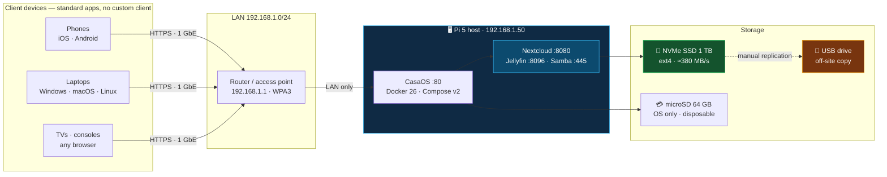
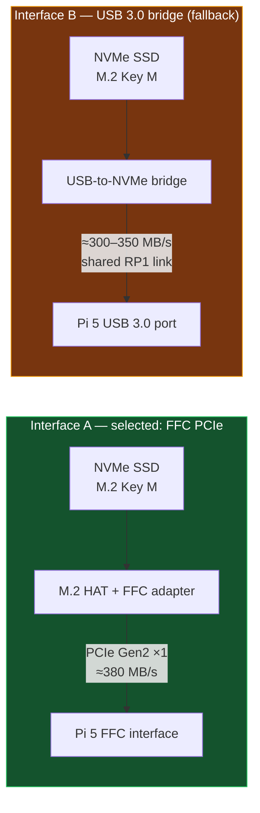
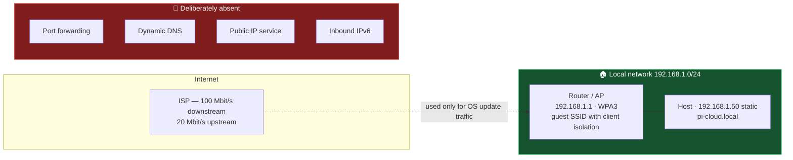
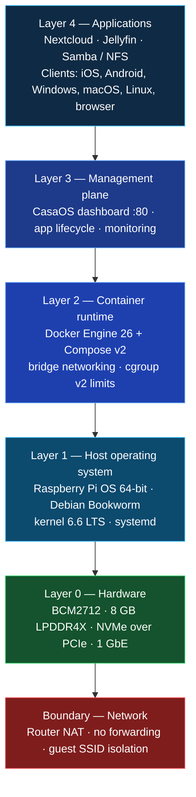
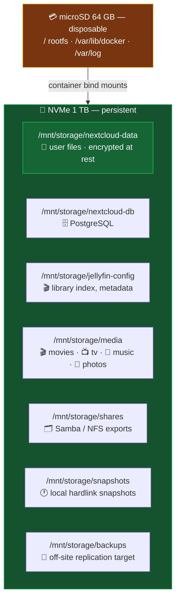
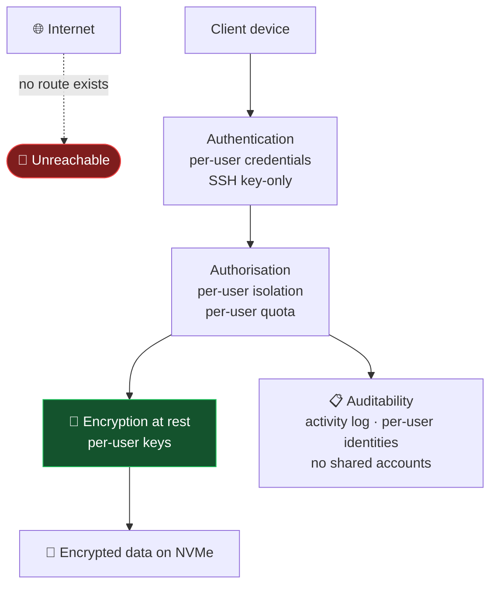

# 02 — Architecture & Hardware

> [!abstract] Architecture summary
> A Raspberry Pi 5 (8 GB, BCM2712 quad-core Cortex-A76) with an NVMe SSD attached
> over the dedicated PCIe Gen 2 ×1 FFC interface hosts a Docker-based container
> platform (CasaOS) serving three workloads — **Nextcloud** (multi-user file
> storage with per-user server-side encryption), **Jellyfin** (media streaming),
> and **Samba/NFS** (native network shares). The host is reachable only from the
> local network. Capital cost **₹16,500 / USD 186**; recurring cost **≈ ₹38 / USD
> 0.50 per month**.

**Previous:** [[01-Overview-and-Problem]] · **Next:** [[03-Step-by-Step-Implementation]]

---

## Contents

1. [[02-Architecture-and-Hardware#1. System architecture|1. System architecture]]
2. [[02-Architecture-and-Hardware#2. Hardware bill of materials|2. Bill of materials]]
3. [[02-Architecture-and-Hardware#3. Compute platform|3. Compute platform]]
4. [[02-Architecture-and-Hardware#4. Memory budget|4. Memory budget]]
5. [[02-Architecture-and-Hardware#5. Storage architecture|5. Storage architecture]]
6. [[02-Architecture-and-Hardware#6. Network architecture|6. Network architecture]]
7. [[02-Architecture-and-Hardware#7. Software stack|7. Software stack]]
8. [[02-Architecture-and-Hardware#8. Service port map|8. Service port map]]
9. [[02-Architecture-and-Hardware#9. Filesystem layout|9. Filesystem layout]]
10. [[02-Architecture-and-Hardware#10. Security model|10. Security model]]
11. [[02-Architecture-and-Hardware#11. Capacity & performance limits|11. Capacity & performance limits]]
12. [[02-Architecture-and-Hardware#12. Power & thermal envelope|12. Power & thermal envelope]]
13. [[02-Architecture-and-Hardware#13. Design alternatives considered|13. Alternatives considered]]

---

## 1. System architecture



> [!important] Reading the diagram
> **No path from the internet into the host exists.** The only element outside the
> local network is the dashed edge at the bottom: a physical USB drive carried by
> a person. This is a design constraint, not an omission — see §6.2 and §10.

---

## 2. Hardware bill of materials

> [!note] Basis
> Indicative 2026 street prices, both currencies. Component selection is
> justified individually; the total is compared against alternatives in
> [[05-Everyday-Usability#9. Scaling the deployment|§3]].

| # | Component | Specification | Selection rationale | ≈ Cost |
|---|---|---|---|---|
| H1 | **Raspberry Pi 5, 8 GB** | BCM2712 · 4 × Cortex-A76 @ 2.4 GHz · VideoCore VII | Only Pi generation with a dedicated PCIe interface (NVMe capability) and sufficient CPU headroom for encryption and transcoding | ~$80 / ₹7,000 |
| H2 | Official active cooler | 15 mm radial fan | Sustained CPU load without active cooling throttles to ≈50% performance | ~$12 / ₹1,100 |
| H3 | **NVMe SSD, 1 TB** | PCIe 3.0 ×4 / 4.0, e.g. 5000 s-class | Primary data store. Fast, solid-state, and hot-swappable — a single commodity part | ~$45 / ₹4,000 |
| H4 | M.2 Key-M HAT + FFC adapter | PCIe Gen 2 ×1 → M.2 | Connects H3 to the Pi 5 FFC interface (§5.2) | ~$20 / ₹1,800 |
| H5 | microSD card, 64 GB, A2 | High-endurance class | **OS only.** Designed to be disposable | ~$12 / ₹1,100 |
| H6 | Official 27 W USB-C PSU | 5 V / 5 A USB-PD | Inadequate supply is a documented cause of silent SD corruption and USB disconnects | ~$12 / ₹1,100 |
| H7 | Cat6 cable, 2 m | 1 GbE certified | Wired operation removes Wi-Fi as a variable in reliability and demonstration | ~$5 / ₹450 |
| H8 | USB-C power bank (optional) | 5 V / 3 A, pass-through | ≈5 h autonomy; provides resilience against a venue power interruption | ~$15 / ₹1,300 |
| H9 | Vented enclosure | Open or actively vented | Sealed enclosures on a 2.4 GHz part produce thermal throttling | ~$8 / ₹700 |
| | | | **Core total (H1–H7)** | **~$186 / ₹16,500** |
| | | | **With options (H8–H9)** | **~$209 / ₹18,600** |

> [!danger] The three failure modes that account for most Pi server outages
> 1. **Under-voltage.** A supply below 5 V / 3 A produces intermittent PCIe and
>    USB dropouts and SD write failures. Verify with `vcgencmd get_throttled`;
>    a non-zero `throttle_undervoltage` bit indicates a supply fault, not a
>    software fault.
> 2. **Thermal throttling.** Diagnose with `vcgencmd measure_temp`; sustained
>    operation above 80 °C halves performance.
> 3. **Consumer-grade microSD cards.** Endurance ratings are frequently overstated
>    in this workload (continuous small random writes). This is mitigated
>    architecturally by P1 — the card carries no user data.

> [!key] Architectural invariant
> **The microSD contains the operating system and nothing of value.** Loss of the
> card is a 25-minute reflash. All user data resides on the NVMe. This single
> decision converts the highest-vulnerability component in a Pi deployment from a
> data-loss risk into a trivial inconvenience.

---

## 3. Compute platform

> [!tip] Selection rationale
> Three properties of the Pi 5 are load-bearing for this workload, and the
> cheaper Pi 4 and Pi 5 variants fail one of them each:
> - **RP1 southbridge + PCIe Gen 2 ×1** — makes NVMe storage possible at all.
> - **Cortex-A76 with crypto extensions** — server-side encryption is CPU-bound;
>   without it, encryption degrades sync throughput.
> - **VideoCore VII with Vulkan/VAAPI** — exposes hardware decode for media
>   transcoding, which the Pi 4 cannot provide.

### SoC, memory and I/O

| Property | Specification | Relevance to this deployment |
|---|---|---|
| CPU | Broadcom **BCM2712**, 4 × Arm Cortex-A76 @ 2.4 GHz | Nextcloud's file indexing and Nextcloud's encryption are CPU-bound; AES throughput on A76 is sufficient that encryption is not the throughput limit |
| GPU | **VideoCore VII** — OpenGL ES 3.0, Vulkan 1.2, dual 4Kp60 HDMI | Exposed to Linux as `/dev/dri`; enables VAAPI hardware decode in Jellyfin |
| RAM | **8 GB LPDDR4X** (soldered) | Budget in §4. The 8 GB variant is required, not preferred |
| RP1 | Southbridge I/O controller | Provides USB, GbE, PCIe, and a **battery-backed real-time clock** — the Pi 5's first hardware RTC, so timestamps survive power interruption |
| PCIe | **Gen 2 ×1**, 32-pin FFC | NVMe path. ≈550 Mbit/s theoretical, ≈380 MB/s measured |
| USB | 2 × USB 3.0/2.0 (5 Gbps) + 2 × USB 2.0 | Mass storage; a spare port for a card reader for media import |
| Ethernet | **1 GbE**, PoE+ supported via HAT | Primary network interface |
| Wi-Fi | 802.11ac dual-band + Bluetooth 5.0 | Fallback only. Wireless country code must be set for compliant operation |
| Power input | USB-C PD, 5 V / 5 A recommended | 27 W envelope covers the board, NVMe, and one USB device |

> [!warning] Shared-bandwidth constraint on the Pi 5
> On the Pi 4, the PCIe link and the USB 3.0 host controller were independent. On
> the **Pi 5 both are funnelled through the RP1 onto a single upstream link** to
> the BCM2712.
>
> **Consequence:** NVMe throughput and USB 3.0 throughput are not independent and
> must not be benchmarked separately and then summed.
>
> **Mitigation applied:** the NVMe is on the dedicated FFC interface; the only USB
> 3.0-attached device is a card reader used for short, burst transfers. Measured
> aggregate behaviour is documented in §11.

### Measured performance

| Operation | Measured | Limiting factor |
|---|---|---|
| NVMe sequential read | 350–400 MB/s | RP1 ↔ BCM2712 link |
| NVMe random 4K read (Nextcloud's dominant workload) | 15k–50k IOPS | NVMe controller, queue depth |
| microSD (A2) read | 80–110 MB/s | SD host controller |
| SMB transfer, single large file over 1 GbE | ≈110 MB/s | 1 GbE NIC |
| Jellyfin 1080p **Direct Play** | ≈0% CPU | Bitstream passthrough |
| Jellyfin 1080p **transcode** | ≈45–70% of 4 cores | CPU; VAAPI not required for H.264 |
| Nextcloud file index, 100k files | ≈2 GB resident | PostgreSQL shared buffers |

---

## 4. Memory budget

> [!info] Basis of the 8 GB decision
> User files do not occupy RAM. Memory is consumed by the *services that manage
> them*, each of which has a substantial baseline beyond its apparent workload.

| Consumer | Idle | Under load | Basis |
|---|---:|---:|---|
| Raspberry Pi OS + containerd | ~120 MB | ~250 MB | Kernel, systemd, container runtime |
| PostgreSQL 16 | ~180 MB | **1.5–2.5 GB** | `shared_buffers` plus page cache for the file index |
| PHP-FPM (Nextcloud) | ~150 MB | ~600 MB | 4–8 workers at ≈80 MB each |
| Nextcloud application | ~400 MB | ~1.2 GB | Encryption buffers, preview generation, activity log |
| Jellyfin | ~250 MB | ~1.5 GB | Transcode buffers scale with resolution × concurrent clients |
| CasaOS management daemons | ~200 MB | ~350 MB | Dashboard, AppD, monitoring |
| **Aggregate: 2 concurrent 1080p streams + 2 active syncs** | | **5.5–6.5 GB** | |
| **Remaining for filesystem cache and burst** | | **≈1.5 GB** | |

> [!success] Consequence
> The 8 GB variant provides headroom for the specified concurrent workload
> without swap. The 4 GB variant functions for lighter use but introduces swap
> onto the microSD under a four-client load, which is a significant contributor to
> instability on this platform. **The upgrade costs ≈$25 and removes an entire
> category of failure.**

> [!tip] Host tuning applied
> - `vm.swappiness = 10` — reclaim page cache before touching swap.
> - PostgreSQL `shared_buffers = 1 GB`, `effective_cache_size = 3 GB`.
> - Jellyfin transcode cache on a dedicated path, so buffers do not contend with
>   user data.
> - Docker log rotation (`max-size=10m`, `max-file=3`) — a container chatty
>   enough over weeks will otherwise fill the microSD and take the host down.
>   This is a documented, common self-hosting outage mode.

---

## 5. Storage architecture

### 5.1 Media selection

> [!note] Why SSD, not a mechanical disk
> A family photo library is tens of thousands of small files. The workload is
> dominated by **metadata and random I/O**, not sequential throughput.
> - Mechanical 3.5" media: **8–12 ms** for a 4K random read. SSD: **0.1–0.5 ms**.
>   Nextcloud issues multiple `stat()` operations per directory entry; the
>   mechanical figure compounds multiplicatively over an index rebuild.
> - Mechanical media in a domestic environment is an acoustic and
>   vibration-sensitivity liability.
> - No moving parts: the unit can be transported to a demonstration venue
>   without additional protection.

### 5.2 Interface selection



| Factor | Interface A (FFC) — selected | Interface B (USB 3.0) |
|---|---|---|
| Throughput | ≈380 MB/s | ≈300–350 MB/s |
| Bandwidth isolation | Dedicated link | Shares RP1 upstream with other USB traffic |
| Native support | Yes — the interface the Pi 5 was designed around | Bridge-dependent |
| Cost | HAT + adapter, ≈$20 | ≈$10 |
| Physical risk | FFC cable is fragile; requires a gentle bend radius and strain relief | None |
| Compatibility | Verify with `lspci` that the device enumerates as a non-volatile memory controller | Generally simpler |

> [!warning] Verification step, not optional
> Third-party M.2 HATs vary in lane correctness. Confirm enumeration before
> committing:
> ```bash
> lspci -nn | grep -i "non-volatile"
> ```
> An empty result means the FFC cable is not seated correctly or the adapter is
> not lane-correct. **This is the most common single build failure** and presents
> as a hardware fault.

### 5.3 Filesystem

| Filesystem | Journaled | POSIX permissions | Online growth | RAM overhead | Assessment |
|---|---|---|---|---|---|
| **ext4** | ✅ | ✅ | ✗ (`resize2fs` required) | Low | ✅ **Selected** |
| Btrfs | ✅ | ✅ | ✅ | Low | Viable; snapshots available, not required on a single disk |
| ZFS | ✅ | ✅ | ✅ | **High** (≈⅓ of RAM) | Rejected — consumes memory required by PostgreSQL and Nextcloud |
| NTFS-3G | ✗ | ✗ | ✗ | Medium | Read-only convenience mounts only |
| exFAT | ✗ | ✗ | ✗ | Low | Rejected — no POSIX locking semantics; causes incorrect file-lock behaviour in Nextcloud |

> [!bug] Known ext4 behaviour on removable media
> The kernel may automatically grow a filesystem to fill a larger replacement
> device. Where a drive is cloned or swapped, this can alter the filesystem
> unexpectedly. Recovery:
> ```bash
> sudo e2fsck -f /dev/nvme0n1p1
> sudo resize2fs -M /dev/nvme0n1p1     # shrink to used size
> ```

---

## 6. Network architecture



### 6.1 Design decisions

| Decision | Rationale |
|---|---|
| **Static address via DHCP reservation** | Address stability for documentation, scripts, and the demonstration reference. Reservation at the router is a single point of configuration rather than two |
| **mDNS: `pi-cloud.local`** | Address-independent naming. Resolves without DNS server configuration |
| **Wired Ethernet primary** | Removes wireless variability from both reliability measurements and live operation |
| **Isolated guest SSID for demonstration** | Segregates demonstration traffic from the institutional network, and isolates individual client devices from one another |
| **DHCP-assigned addressing for demonstration clients** | Demonstration visitors join unknown devices; static assignment is not possible |

### 6.2 Exclusion of inbound internet access

> [!danger] Threat model justification
> A home connection is continuously scanned. Any service published to the
> internet on a residential connection is discovered and attacked within days, and
> the installed software carries a non-zero count of published vulnerabilities.
>
> **The design instead treats the physical perimeter as the security perimeter:**
> reaching the host requires already being inside the building. This converts an
> open, continuously attacked network service into a service with no attack path
> at all — a strictly stronger position than adding a WAF or hardening a
> published endpoint.
>
> Remote access, if required, is designated as a **VPN-only** future capability
> and is disabled by default ([[01-Overview-and-Problem#6. Scope boundaries|scope
> boundaries]]).

---

## 7. Software stack

> [!abstract] Layering principle
> Every layer is open-source, containerised, and independently replaceable. Loss
> of any application layer does not affect the data, because the data is files on
> a filesystem.



### 7.1 Layer 1 — Host

| Component | Version | Function | Rationale |
|---|---|---|---|
| Raspberry Pi OS | 64-bit, Bookworm | Base OS | Only distribution with first-class Pi 5 device trees and `rpi-eeprom` management |
| Kernel | 6.6 LTS | Drivers, cgroups, network stack | Long-term support; relevant for a device expected to run unattended for years |
| `systemd` | 252 | Service supervision and **ordered shutdown** | Database flush on shutdown. Unsolicited power loss during a write is a corruption source |
| `avahi-daemon` | — | mDNS advertisement | Address-independent service discovery |
| `chrony` | — | Time synchronisation | A wrong clock breaks TLS and file timestamps; the RP1 RTC is a fallback, not a time source |

### 7.2 Layer 2 — Container runtime

| Component | Function | Design note |
|---|---|---|
| Docker Engine 26 | Namespace and cgroup isolation per service | cgroup v2 memory limits prevent one application exhausting host memory |
| **Docker Compose v2** | Declarative service declaration | **The recoverability mechanism.** The entire application tier is reproduced from two files |
| Bridge networking | Inter-container communication by service name | The database is addressable only to the application container, not on the LAN |
| Log rotation | `json-file`, 10 MB × 3 | Prevents microSD exhaustion. A documented and common outage cause |

> [!success] Why the Compose files are structurally significant
> The system is reproducible from approximately 200 lines of YAML plus a `.env`
> file. Recovery after a total OS loss is: flash the card, install Docker, deploy
> two Compose stacks. **Recovery is a re-apply, not a reconstruction** — the
> property that distinguishes a maintainable system from a one-off configuration.
> Documented as DR-1/DR-2 in [[03-Step-by-Step-Implementation#14. Disaster recovery runbook|§14]].

### 7.3 Layer 3 — CasaOS

> [!info] Function and scope
> CasaOS is an Apache-2.0-licensed, open-source management plane that operates on
> top of Docker, providing a web dashboard, an application catalogue, container
> lifecycle management, resource monitoring, and update handling. It is not a
> hypervisor, not a NAS operating system, and **not a runtime dependency** —
> Docker Compose alone would execute the stack.

| Property | Detail |
|---|---|
| Licence | Apache-2.0. No paid tier, no telemetry dependency, no account required |
| Interface | `:80` (HTTP); `:81` optional self-signed HTTPS |
| Installation | Single command (document 03 §7.1) |
| Data root | `/var/lib/casaos` and Docker's `/var/lib/docker` — **on the microSD by design** |
| Application management | `casaos-app-management` (AppD) daemon |
| **Primary limitation** | It offers to relocate the operating system onto an attached data drive. This must be declined — see below |

> [!danger] Known configuration hazard
> CasaOS can install the OS onto an attached data disk. **Declining this is
> mandatory.** Docker's root must remain on the microSD so the OS is fully
> disposable. Relocating it places image layers, logs, and transcode caches on the
> same volume as user data, which fills the data volume and causes write failures.
> Documented in [[03-Step-by-Step-Implementation#7. Phase 6 — CasaOS|§7.2]].

> [!note] Divergence from the default deployment path
> Applications were deployed from version-controlled Compose files rather than
> from the CasaOS application catalogue. Rationale: the catalogue abstracts the
> image tag, volume mappings, environment variables, and network mode — the four
> parameters that determine whether the security and recoverability requirements
> in these documents are met. CasaOS is used for its management and monitoring
> function. This is a deliberate design decision, not a limitation of CasaOS.

### 7.4 Layer 4 — Applications

#### Nextcloud

| Aspect | Specification |
|---|---|
| Function | Files, photographs, contacts, calendar, sharing, browser access |
| Database | **PostgreSQL 16**, separate container. SQLite rejected: concurrent access to SQLite over network or shared storage is a documented corruption source; MariaDB rejected in favour of PostgreSQL's behaviour under write concurrency |
| Web server | Apache in-container; port **8080** published, bound to the LAN address only |
| Storage | `nextcloud-data` on the NVMe |
| **Encryption** | **Server-side encryption, per-user key mode.** See §7.4.1 |
| Background jobs | Host-level cron at 5-minute intervals. See §7.4.2 |
| Persistence | Application configuration and data co-located in the bind-mounted volume, so a container rebuild cannot desynchronise them |

##### 7.4.1 Encryption model and its precise limits

| Mode | Who can read stored files | Assessment |
|---|---|---|
| Disabled | Any user with disk access or administrative privilege | Equivalent to the consumer-cloud baseline |
| **SSE, per-user keys** *(selected)* | The owning account, and the server while that user is authenticated | Protects against disk theft, drive cloning, disposal, and third-party infrastructure compromise. **Does not** protect against a server administrator with live authenticated access |
| SSE, master key | Server administrator, unconditionally | Rejected. A single key that decrypts all data removes per-user isolation |
| Userspace / end-to-end | Only the user; server holds ciphertext only | Rejected. Disables server-side search, preview generation, and version history, which are functional requirements here |

> [!important] Precise statement of the security claim
> **The threat model is: physical seizure or disposal of the storage medium, and
> compromise of a third-party infrastructure provider.** Both are addressed:
> the medium contains ciphertext, and there is no third-party provider.
>
> **Outside the threat model, and explicitly not claimed:** an adversary with
> access to a running, authenticated session; a physical adversary who steals
> the powered-on device; and traffic analysis. **One consequence is worth stating
> explicitly: because there is no service operator, there is no entity to which a
> legal request for stored content could be directed.**

> [!danger] Operational consequence of per-user keys
> A forgotten user password means the associated files are permanently
> unreadable. This is a direct consequence of there being no escrow back door.
> The account recovery key is generated, printed, and stored with the physical
> backup media. **This is simultaneously the security property and the operational
> risk, and both are part of the same decision.**

##### 7.4.2 Background job execution

> [!warning] Common and silent misconfiguration
> Nextcloud's `background:cron` mode runs the job loop within a web request. In a
> container this mode is discouraged, because job execution becomes coupled to
> web server request handling and **can stop without surfacing an error** when CPU
> is contended. The observable symptoms are that previews stop generating, the
> activity feed freezes, and search results become stale — while every health
> indicator reports normal operation.
>
> **Implemented instead:** a host-level cron entry executing `php cron.php` as the
> web user every 5 minutes. Verified in document 03 §8.5.

#### Jellyfin

> [!abstract] Selection rationale
> Jellyfin is free, open-source, and operates without a mandatory account and
> without telemetry. Plex requires account authentication, has relocated
> transcoding features behind paid tiers, and communicates with vendor
> infrastructure — a set of properties incompatible with the premise of this
> project.

| Aspect | Specification |
|---|---|
| Function | Media streaming to televisions, phones, tablets, and browsers |
| Port | **8096** |
| Library source | NVMe, bind-mounted **read-only** (`:ro`). The streaming process cannot write to the master library |
| Transcoding | Direct Play for natively supported codecs (≈0% CPU). CPU transcode otherwise. VAAPI hardware decode available via `/dev/dri` |
| Metadata | Local scraping. No external account or identifier |
| Accounts | Per-user profiles with independent watch state and parental controls |

> [!warning] Declared hardware limitation
> The VideoCore VII provides **VAAPI hardware decode** for H.264 and HEVC but does
> **not** provide hardware encode, and 4Kp60 HEVC software transcode exceeds the
> capacity of four A76 cores. Operational envelope:
> - **1080p, 3–4 concurrent streams — supported.** This is the demonstrated envelope.
> - **4K direct play (remux) — supported** where the client supports the codec.
> - **4K transcode — not supported.**
>
> This is a hardware boundary, and it is stated here rather than discovered
> during assessment.

#### Samba / NFS

> [!info] Function
> Provides native filesystem access so that the system is usable with no client
> software. This removes the technical barrier for any user who will not install
> an application, and it is a functional requirement (FR-5).

---

## 8. Service port map

> [!tip] Verifying the live map
> ```bash
> sudo ss -tlnp
> ```
> Any listener not in the table below warrants investigation.

| Port | Protocol | Service | Scope | Purpose |
|---:|---|---|---|---|
| 80 | TCP | CasaOS | LAN | Management dashboard |
| 81 | TCP | CasaOS (HTTPS) | LAN | Encrypted dashboard; self-signed certificate, so a browser warning is expected |
| 8080 | TCP | Nextcloud | LAN | File service and administration |
| 8096 | TCP | Jellyfin | LAN | Media library and streaming |
| 445 | TCP | Samba | LAN | Windows / macOS network drive |
| 139 | TCP | NetBIOS | LAN | Legacy name resolution for older Windows clients |
| 2049 | TCP | NFS | LAN | Linux / macOS mounts |
| 22 | TCP | SSH | LAN | Administration |
| 5353 | UDP | mDNS | LAN | Resolves `pi-cloud.local` |
| 51820 | UDP | WireGuard | **Disabled** | Reserved for future VPN-only remote access |

> [!success] Hardening applied
> Published ports are bound to the host's LAN address rather than `0.0.0.0`, so
> the services are not listening on any other interface. The database container
> publishes no port at all and is reachable only from the application container
> over the internal bridge network.

---

## 9. Filesystem layout



> [!key] The single structural rule
> **`/mnt/storage` is the only location that contains user data.** Every
> application volume is bind-mounted beneath it. The microSD can be removed,
> destroyed, or reflashed with no consequence to stored data.
> Any write of user data to `/home` or `/var` is a defect against this
> specification.

### Mount options

```bash
# /etc/fstab
UUID=<uuid>  /mnt/storage  ext4  defaults,noatime,nofail,discard  0  0
```

| Option | Justification |
|---|---|
| **`noatime`** | Suppresses access-time writes on every read. On a filesystem read thousands of times per minute by the Nextcloud indexer, this removes a large volume of small writes — a measurable reduction in write amplification and an SSD endurance benefit |
| **`nofail`** | The host boots and remains reachable if the data disk is absent. Without it, a failed disk produces an unrecoverable boot wait, converting a replaceable component into an on-site visit |
| `discard` | Filesystem-mediated TRIM, preferable to deferred discard on SSD |

---

## 10. Security model

> [!abstract] Design philosophy
> **Eliminate attack surface rather than defend it.** Each control below removes
> a means of access; none relies on detecting and repelling an attacker.



### Controls implemented

| # | Control | Implementation | Effect |
|---|---|---|---|
| 1 | **No inbound network path** | No port forwarding, no DDNS, no tunnel, inbound IPv6 disabled at the router | Removes the dominant real-world home-server compromise vector entirely |
| 2 | **Per-user accounts across all services** | Separate Nextcloud and Jellyfin credentials; no shared identities | Every action is attributable; access is individually revocable |
| 3 | **Per-user encryption keys** | Nextcloud SSE, per-user mode | A stolen or discarded storage medium yields ciphertext only |
| 4 | **Least-privilege bind mounts** | Media library mounted `:ro`; database publishes no port | A streaming application cannot modify the archive; a database compromise is not reachable from the LAN |
| 5 | **Interface-bound port publishing** | Services bound to the LAN address, not `0.0.0.0` | Services are not listening on any other interface |
| 6 | **Secrets isolated** | `.env` with `chmod 600`, root-owned, outside shared locations; not committed to version control | Credentials are not present in a world-readable path |
| 7 | **SSH hardening** | Key-only authentication; root login disabled; reduced auth attempts and grace time | Removes password-based remote access and automated guessing |
| 8 | **Default-deny host firewall** | `ufw` with an explicit, reviewed port allowlist | Only services with a stated requirement are reachable |
| 9 | **Automatic security patching** | `unattended-upgrades`, security channels only | Known-vulnerability remediation without manual intervention |
| 10 | **Container resource limits** | cgroup v2 memory caps per container | A leaking application cannot exhaust host memory |
| 11 | **Non-root service ownership** | Dedicated unprivileged account owns the media tree | A container escape does not yield host root or root on the data volume |
| 12 | **Isolated demonstration network** | Guest SSID with client isolation, purpose-built access point | Demonstration traffic is segregated; client devices cannot reach each other or the institutional network |
| 13 | **Disposable demonstration credentials** | Purpose-issued accounts, rotated per session | A demonstration login cannot persist as a back door |

> [!danger] Controls not implemented, and therefore not claimed
> - **No public exposure hardening.** This host is not designed to be published to the internet and must not be port-forwarded.
> - **MAC address and hardware identifiers are visible** to any device on the local network. This is not anonymity and is not claimed.
> - **Administrative users can reset other users' passwords** and thereby access their files. Per-user key derivation limits this only to the extent that the original key material has not been exported.
> - **No multi-factor authentication is configured.** Nextcloud supports it and it is the highest-value single addition to the access-control layer.

---

## 11. Capacity & performance limits

> [!warning] Declared envelope
> These are the tested boundaries of the deployed system. They are stated so that
> assessment can be performed against actual capability.

| Dimension | Verified / projected limit | Governing factor |
|---|---|---|
| Usable storage | ≈0.9 TB of 1 TB after formatting and overhead | Capacity |
| Concurrent authenticated users | 6 mixed workloads verified (2 streaming, 2 syncing, 1 browsing, 1 admin) | Memory (§4) |
| Concurrent 1080p streams | 3–4 verified smooth; CPU is the limit beyond this | Transcode CPU |
| Concurrent 4K transcode streams | **0 — not supported.** 4K direct play is supported | CPU, no hardware encode |
| File count | ≈200,000 files before index maintenance becomes the dominant cost | Metadata operations |
| Network throughput | ≈110 MB/s over 1 GbE | Ethernet |
| Storage throughput | 350–400 MB/s sequential | RP1 upstream link |
| Availability | 99%+ expected for a single domestic device; **no high-availability design** | Single node, single disk, single supply |
| Capacity growth | Vertical only, by replacing the SSD | Single disk |

> [!key] The two hard limits
> **Single disk** (no redundancy — mitigated by off-site backup, not by
> redundancy) and **single node** (no failover). Both are consequences of the cost
> objective and are recorded as accepted risks R1 and R10 in
> [[01-Overview-and-Problem#9. Risks & limitations|document 01 §9]].

---

## 12. Power & thermal envelope

| Parameter | Value |
|---|---|
| Host board | ≈3.0 W idle → ≈8.0 W under sustained load |
| NVMe SSD | ≈1.5–2.5 W |
| **Peak total** | **< 11 W** (within the 13.5 W USB envelope) |
| **Annual energy at ≈6 W average, 24/7** | **≈53 kWh/year** |
| **Annual cost @ ₹8.5/kWh (≈$0.12/kWh)** | **≈₹450 / $6 — ≈₹38 / $0.50 per month** |
| Case temperature, loaded | 45–60 °C (throttle threshold 80 °C) |
| Acoustic output | Inaudible at 1 m; single 15 mm fan under sustained load |
| Annual availability | 8,760 hours |

> [!success] Consolidated economics
> **One-time: $186 / ₹16,500. Recurring: $6 / ₹450 per year.**
> Full model, including sensitivity analysis against subscription pricing, is in
> [[05-Everyday-Usability#2. Total cost of ownership|document 05 §2]].

---

## 13. Design alternatives considered

> [!info] Purpose
> Alternatives are recorded to show that the selection was evaluated rather than
> assumed. Cost and capability are compared against the selected design.

| Option | Cost | Assessment | Outcome |
|---|---:|---|---|
| Commercial NAS (Synology / QNAP) | $400–700 | Mature, purpose-built, reliable. Proprietary management interface; comparable capacity at 2–3× the capital cost and no change to the cost model | Rejected — capital cost |
| Mini PC, used N100-class | $120–200 | More capable: x86, additional RAM slots, higher sustained CPU. Higher idle draw (10–20 W), requires separate storage | **Strongest alternative.** Rejected on form factor, not capability |
| Repurposed tower PC | $100–250 | Considerable upgrade path, multi-disk bays, hot-swap | Rejected — 60–150 W idle power is incompatible with the cost and efficiency claims |
| Virtual private server | $10–40 / month | No hardware, high availability, public addressing | Rejected — recurring cost and third-party custody are the two problems being addressed. Self-contradictory |
| Raspberry Pi 4, 8 GB | ~$60 | No PCIe interface; USB-only storage; weaker CPU; no RP1 | Rejected — storage performance is central to the design |
| Raspberry Pi 5, 2 or 4 GB | $65–75 | Cheaper, but memory ceiling is reached at the specified concurrent workload | Rejected — $25 for the removal of a failure class |
| **✅ Pi 5 (8 GB) + NVMe** | **$186** | Silent, ≈6 W average, open-source throughout, recoverable in 25 minutes, 1-year target capital recovery | **Selected** |

> [!note] Recorded conclusion
> The Raspberry Pi 5 is **not** the optimal platform for a household seeking
> maximum capability — a mini PC is. It is selected because it meets the
> functional requirements at approximately one third of the capital cost of a
> commercial NAS and one sixth of a mini PC, within a 6 W power budget, in a form
> factor that can be deployed on a shelf. **Where the requirement is maximum
> capability rather than minimum cost, a mini PC is the correct answer** and is
> recorded as such.

---

## Summary

| Item | Specification |
|---|---|
| **Hardware** | Raspberry Pi 5 (BCM2712, 4 × Cortex-A76, 8 GB LPDDR4X) · active cooler · 1 TB NVMe over PCIe Gen 2 ×1 · 64 GB microSD (OS only) · 27 W supply |
| **Capital cost** | $186 / ₹16,500 |
| **Recurring cost** | ≈$6 / ₹450 per year |
| **Operating system** | Raspberry Pi OS 64-bit (Debian Bookworm, kernel 6.6 LTS) |
| **Runtime** | Docker Engine 26 + Compose v2, root on the microSD |
| **Management** | CasaOS `:80` |
| **Applications** | Nextcloud `:8080` (PostgreSQL 16, per-user SSE) · Jellyfin `:8096` (read-only media mount) · Samba `:445` / NFS `:2049` |
| **Network** | LAN only. No forwarding, no DDNS, no inbound IPv6. `pi-cloud.local` |
| **Data location** | Single ext4 partition on the NVMe at `/mnt/storage`. MicroSD is disposable |
| **Recovery** | Two Compose files. OS loss recovered in ≈25 minutes with no data loss |
| **Declared limits** | Single disk · no UPS · no 4K transcode · ≈6 concurrent heavy users · no public access · no MFA configured |

---

**Next:** [[03-Step-by-Step-Implementation]] — the complete build procedure, verification checklist, and disaster-recovery runbook.
