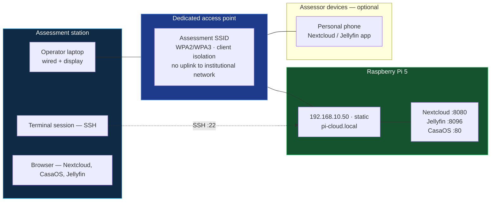

# 04 — Demonstration Protocol & Verification Record

> [!abstract] Document purpose
> Defines the live assessment procedure: the demonstration environment, the
> preconditions verified before assessment begins, the ordered sequence of
> demonstrations with the evidence produced by each, the contingency for
> component failure, and an **independent verification sheet** on which the
> assessor records results. Every capability claim in this documentation set is
> demonstrated by a step in this protocol and recorded on that sheet.

**Previous:** [[03-Step-by-Step-Implementation]] · **Next:** [[05-Everyday-Usability]]

---

## Contents

1. [[04-Interactive-Demo-Guide#1. Assessment objectives|1. Assessment objectives]]
2. [[04-Interactive-Demo-Guide#2. Demonstration environment|2. Demonstration environment]]
3. [[04-Interactive-Demo-Guide#3. Network configuration|3. Network configuration]]
4. [[04-Interactive-Demo-Guide#4. Pre-assessment readiness check|4. Pre-assessment readiness check]]
5. [[04-Interactive-Demo-Guide#5. Demonstration sequence|5. Demonstration sequence]]
6. [[04-Interactive-Demo-Guide#6. Evidence artefacts|6. Evidence artefacts]]
7. [[04-Interactive-Demo-Guide#7. Independent verification sheet|7. Independent verification sheet]]
8. [[04-Interactive-Demo-Guide#8. Contingency procedures|8. Contingency procedures]]
9. [[04-Interactive-Demo-Guide#9. Security during public assessment|9. Security during public assessment]]
10. [[04-Interactive-Demo-Guide#10. Limitations to be disclosed|10. Limitations to be disclosed]]

---

## 1. Assessment objectives

> [!important] What the assessment must establish
> | # | Objective | Demonstrated by |
> |---|---|---|
> | O1 | The system is **functional** — file storage, multi-user accounts, and media streaming operate correctly | D-1, D-3, D-4 |
> | O2 | Data is **genuinely encrypted at rest**, verified by independent inspection rather than application reporting | **D-2** |
> | O3 | Users are **isolated** from one another | D-5 |
> | O4 | The system is **independent of internet connectivity** | **D-6** |
> | O5 | The system **recovers unattended** from a full restart | D-7 |
> | O6 | Data is **recoverable** — a backup is restored and opened | **D-8** |
> | O7 | The **build is reproducible** — the deployment is declared in version-controlled files, and recovery does not require re-authoring | D-9 |
> | O8 | **Costs and limits are stated accurately** | Documents 01 §9, 02 §11, 05 |

> [!note] Design principle of this protocol
> Demonstrations are ordered so that **the strongest verification is performed
> first** and the most operationally fragile demonstration last. D-2 (filesystem
> inspection) and D-8 (restore) require a working terminal and take the longest;
> they are positioned where a subsequent failure cannot invalidate them.

---

## 2. Demonstration environment



> [!info] Assessment network
> The system is demonstrated on a **dedicated access point with no uplink to
> the institutional network**. This satisfies the isolation requirement (control
> 12, document 02 §10) and removes any dependency on external connectivity
> during the assessment. A distinct subnet is used so that a pre-configured
> address on a different network cannot conflict with the demonstration
> configuration.

| Component | Configuration | Rationale |
|---|---|---|
| Access point | Dedicated, no uplink, 2.4 GHz + 5 GHz, client isolation enabled | Segregates assessment traffic; prevents device-to-device reachability |
| Host address | `192.168.10.50`, static | Non-overlapping with the operational deployment range; documented on all reference material |
| Host name | `pi-cloud.local` (mDNS) | Address-independent reference; the same name resolves on the operational network |
| Operator station | Wired Ethernet | Removes wireless variability from the assessment |
| Demonstrator client | A personal phone or tablet, optional | D-11 demonstrates third-party client compatibility; it is optional because the mobile app requires prior installation by the assessor |

> [!note] Why assessor devices are optional rather than assumed
> Installing a client application onto an assessor's personal device is
> inappropriate as a precondition. D-1 through D-10 are complete and
> self-contained on the operator station. D-11 is executed only if the assessor
> has the application already available, and is recorded as *not performed*
> otherwise. **A demonstration is not marked as failed because a precondition
> outside the project's control was not met.**

---

## 3. Network configuration

> [!danger] Two documented and common failure modes
> | Symptom | Cause | Resolution |
> |---|---|---|
> | Host unreachable, but responds to `ping` | Wireless **client isolation** enabled on the access point | Disable client isolation, or connect the host by cable |
> | Host unreachable entirely | Static address in a subnet the assessment laptop is not on | Confirm the laptop is associated with the assessment SSID and holds an address in `192.168.10.0/24` |
>
> Both were encountered during preparation of this deployment and both produce
> identical external symptoms. The readiness check in §4 detects each before
> assessment begins.

### Address reference

| Service | URL |
|---|---|
| Management dashboard | `http://192.168.10.50` |
| File service | `http://192.168.10.50:8080` |
| Media service | `http://192.168.10.50:8096` |
| Host name (any service) | `http://pi-cloud.local[:8080 \| :8096]` |
| Administrative access | `ssh <user>@192.168.10.50` |

---

## 4. Pre-assessment readiness check

> [!important] Procedure
> Executed **30 minutes before assessment begins** and repeated immediately
> before. Every row must read PASS. A single FAIL aborts the assessment and is
> remediated before it proceeds — a partially functional system presented as
> complete is a worse outcome than a delayed start.

```bash
picloud-health
```

| # | Check | Method | Required result |
|---|---|---|---|
| R1 | Host reachable | `ping -c3 192.168.10.50` | 0% packet loss |
| R2 | Hostname resolves | `ping -c2 pi-cloud.local` | Replies |
| R3 | Compute platform | `lscpu \| head -5` | 4 × Cortex-A76, aarch64 |
| R4 | Memory | `free -h` | ≈7.6 GB total, low swap usage |
| R5 | Storage present | `findmnt /mnt/storage` | Mounted on `/mnt/storage` |
| R6 | Storage capacity | `df -h /mnt/storage` | > 20% free |
| R7 | Storage health | `smartctl -H /dev/nvme0n1` | PASSED |
| R8 | Power / thermal state | `vcgencmd get_throttled` | `throttled=0x0` |
| R9 | Temperature | `vcgencmd measure_temp` | < 70 °C |
| R10 | Docker root location | `docker info \| grep "Docker Root Dir"` | `/var/lib/docker` (microSD) |
| R11 | Container state | `docker ps --format '{{.Names}} {{.Status}}'` | All services `Up`, no `Restarting` |
| R12 | CasaOS dashboard | Browse `http://192.168.10.50` | Renders |
| R13 | Nextcloud | Browse `http://192.168.10.50:8080` | Login page, no error banner |
| R14 | Jellyfin | Browse `http://192.168.10.50:8096` | Dashboard loads |
| R15 | Encryption state | `php occ encryption:status` | `enabled`, per-user |
| R16 | Background jobs | `crontab -u www-data -l` | 5-minute entry present |
| R17 | Self-registration | `php occ config:app:get core registration.enabled` | `false` |
| R18 | Snapshots current | `ls -1t /mnt/storage/snapshots \| head -1` | Timestamp within the last 2 hours |
| R19 | Off-site copy present | `ls -l /mnt/backup-usb/nextcloud-data` | Non-empty, dated within 7 days |
| R20 | Log rotation | `docker inspect jellyfin --format '{{.HostConfig.LogConfig}}'` | `json-file`, size limited |
| R21 | MicroSD headroom | `df -h /` | < 70% used |
| R22 | Demonstration accounts | Manual check | Test accounts present, credentials known |
| R23 | Test artefacts | Manual check | Demonstration file present with a **known plaintext string** |
| R24 | Restore test file | Manual check | A known file exists on the off-site copy for D-8 |

> [!warning] R23 is a specific and necessary preparation step
> The encryption demonstration (D-2) works by writing a file containing a known
> string, then searching the storage volume for that string. **The string must
> be prepared in advance** — for example `PI-CLOUD-VERIFY-20260930`. Without it,
> the demonstration degrades into an assertion, which is the outcome this protocol
> exists to avoid.

---

## 5. Demonstration sequence

> [!abstract] Ordering rationale
> Total duration ≈ 22 minutes. D-1 → D-2 establishes function and encryption
> immediately. D-6 (internet disconnection) and D-8 (restore) are the two
> procedures with real elapsed time and are positioned at D-6 and D-8, after
> which no subsequent step depends on external connectivity.

---

### D-1 — Functional overview *(≈2 min)*

**Claim:** the system is operational and provides three distinct service classes.

**Procedure**

1. CasaOS dashboard — display container state, CPU, memory, and both storage
   volumes. *Evidence: control 1 — the management plane reports actual resource
   state rather than a static display.*
2. Nextcloud web interface — sign in, open the Files view.
3. Jellyfin — open the library and display the media index.
4. Samba — open the share from a file manager on the operator laptop
   (`\\192.168.10.50\family`).

**Result:** three service classes reachable from standard clients, with no
client software required for the fourth.

---

### D-2 — Encryption at rest, verified by inspection *(≈3 min)*

> [!success] Primary verification event
> This is the demonstration that substantiates the central technical claim, and it
> is performed by **direct filesystem inspection rather than by reading the
> application's report of its own configuration.**

**Procedure**

```bash
# 1. Confirm the configured state
cd /mnt/storage/nextcloud-data
sudo -u www-data php occ encryption:status
```

```bash
# 2. Write a file containing a known plaintext string through the web interface
#    (upload: PI-CLOUD-VERIFY-20260930.txt)
```

```bash
# 3. Search the storage volume for that string
sudo grep -rl "PI-CLOUD-VERIFY-20260930" /mnt/storage/nextcloud-data/data
```

```bash
# 4. Inspect the raw stored content
sudo -u www-data php occ files:scan --all
find /mnt/storage/nextcloud-data -name 'PI-CLOUD-VERIFY-20260930.txt' \
  -exec sh -c 'echo "== {} =="; head -c 64 "{}" | xxd | head -4' \;
```

**Required results**

| Step | Required result |
|---|---|
| 3 | **No output.** Any filename returned indicates unencrypted storage |
| 4 | Binary output with no readable text |

**Conclusion supported:** the content visible through the application is not
present in readable form on the storage medium.

**Limitation to state at this step:** this protects data at rest. It does not
prevent an administrator with a live authenticated session from reading a file
while its owner is signed in. That boundary is specified in document 02 §7.4.1
and is not concealed by this demonstration.

---

### D-3 — Multi-user operation and isolation *(≈2 min)*

**Claim:** distinct accounts operate independently and are isolated.

**Procedure**

1. Sign in to Nextcloud as user **A**; create a folder and upload a file.
2. Sign in as user **B**.
3. Attempt to navigate to user A's folder.
4. Compare per-user quota reporting between the two accounts.

**Required result:** the cross-user access attempt is **denied**, and the
interruption is presented as a permissions error rather than an application
failure. Quota and usage figures differ per account.

**Corresponds to:** V19, FR-1.

---

### D-4 — Media streaming, concurrent *(≈2 min)*

**Claim:** media streams to standard clients, and concurrently.

**Procedure**

1. Begin a 1080p stream on the operator laptop.
2. Begin a second stream on a second device.
3. Begin a third stream on a third device (or on the operator laptop in a second
   browser profile).
4. Observe CPU and network utilisation during the third stream.

```bash
# Concurrent observation
docker stats --no-stream jellyfin
htop        # or top
```

**Required result:** three simultaneous streams play without buffering; Jellyfin
CPU utilisation remains below full saturation.

**Corresponds to:** V22, V23, NFR-6.

> [!note] Stream selection
> Streams are selected from the library such that **Direct Play** is possible.
> This is stated aloud during the demonstration, together with the reason: Direct
> Play consumes effectively no server CPU, whereas transcoding is CPU-bound and
> is the limiting factor on this platform. The 4K transcode boundary is disclosed
> under §10.

---

### D-5 — Localhost and data custody *(≈1 min)*

**Claim:** the data plane is on-premises.

**Procedure**

1. On the operator laptop, open the Nextcloud and Jellyfin sessions.
2. Disconnect the host from any internet uplink.
3. Re-authenticate a new client device and transfer a file.
4. Observe the transfer rate.

**Required result:** the transfer completes at local network speed with no
internet connectivity in use. This is observation D-6 in the verification record.

---

### D-6 — Operation without internet connectivity *(≈2 min)*

> [!key] Substantiates the custody claim
> This is the demonstration that the system does not depend on a third-party
> service for its operation.

**Procedure**

```bash
# 1. Confirm external reachability before disconnection
ping -c2 8.8.8.8            # expected: replies

# 2. Physically disconnect the uplink (or disable the interface)
sudo ip link set eth0 down
# (On the assessment network there is no uplink; this step is performed by
#  disconnecting the WAN cable at the access point.)

# 3. Re-test all three services
```

**Required results**

| Test | Required result |
|---|---|
| External reachability | Fails — confirming the disconnection |
| Nextcloud `:8080` | Fully functional |
| Jellyfin `:8096` | Stream plays normally |
| CasaOS `:80` | Renders |
| New file upload | Succeeds |
| Background jobs | `php occ background:cron` completes without error |

**Corresponds to:** V25, C2, NFR-7.

---

### D-7 — Unattended recovery *(≈2 min)*

**Claim:** the system returns to a defined state without operator action.

**Procedure**

```bash
sudo reboot
# Wait for the host to return (≈60–90 s from power-on with a wired connection)
# Do not touch the host.
```

**Required results**

| Test | Required result |
|---|---|
| Reachability after reboot | Automatic, no intervention |
| All containers | `Up`, none in `Restarting` |
| Nextcloud | Login page loads |
| Jellyfin | Dashboard loads |
| Storage volume | Mounted automatically — confirms `nofail` and the fstab entry |

```bash
docker ps --format 'table {{.Names}}\t{{.Status}}'
```

**Corresponds to:** V26, C7.

---

### D-8 — Recovery from backup *(≈4 min)*

> [!success] Second primary verification event
> Demonstrates that the recoverability claim is tested rather than asserted.

**Procedure**

```bash
# 1. State the recovery model
#    Local snapshots: hourly hardlink snapshots on the data volume
#    Off-site replication: weekly to a removable medium held at a separate location
#    RPO: 1 hour (snapshot interval)   RTO: ≈25 minutes (full rebuild, no data loss)

# 2. Confirm the off-site copy exists and is dated
ls -l /mnt/backup-usb/nextcloud-data/
```

```bash
# 3. Restore to an independent location
mkdir -p /tmp/restore-verify
sudo rsync -a /mnt/backup-usb/nextcloud-data/ /tmp/restore-verify/

# 4. Compare the restored copy against the live volume
sudo rsync -a --dry-run --delete \
  /tmp/restore-verify/ /mnt/storage/nextcloud-data/
```

**Required results**

| Step | Required result |
|---|---|
| 3 | Restoration completes without error |
| 4 | **No output** — the restored copy is byte-identical to the live volume |
| 5 | A restored file opens and decrypts with a real user password |

**Corresponds to:** V29, C8, DR-1/DR-2/DR-3.

> [!important] The two recovery models must be distinguished
> - **D-7** demonstrates *service* recovery — services return after a restart. The data is untouched.
> - **D-8** demonstrates *data* recovery — data is restored from an independent copy.
>
> Conflating the two is a common error in this deployment class. They are
> different properties, with different failure modes, and this protocol tests
> both.

---

### D-9 — Declarative reproducibility *(≈2 min)*

**Claim:** the deployment is declared, not hand-configured, and can be reproduced.

**Procedure**

```bash
# 1. Show the complete declaration
cat /opt/picloud/nextcloud/docker-compose.yml
cat /opt/picloud/jellyfin/docker-compose.yml

# 2. Show the recovery path
#    OS card → flash per document 03 §2
#    → install Docker, CasaOS
#    → docker compose up -d   (x2)
#    Data volume is independent of the host.

# 3. Demonstrate teardown and restoration of the service tier
cd /opt/picloud/jellyfin
docker compose down
docker compose ps          # empty
docker compose up -d
docker compose ps          # running
```

**Required result:** the service tier is fully recreated from the declared files
with no manual configuration step.

**Corresponds to:** C3, C9, P3 in document 01 §4.

---

### D-10 — Health instrumentation *(≈1 min)*

```bash
picloud-health
```

**Required result:** the report completes with no `!!` markers, showing load,
thermal and power state, memory, both filesystems, container state, listening
ports, and storage health.

**Note:** this is the same command used for the pre-assessment check (R1–R21). It
is included in the sequence to establish that continuous health monitoring is
available, not merely a one-off verification.

---

### D-11 — Third-party client compatibility *(≈2 min, conditional)*

**Claim:** standard mobile and desktop clients interoperate.

**Procedure** — executed only if the assessor has the application available:

1. Connect the assessor's device to the assessment network.
2. Install or open the Nextcloud application.
3. Sign in with a demonstration account; upload a photograph.
4. Stream a title in Jellyfin.

**Required result:** both applications connect to `192.168.10.50` and function
normally, without any configuration on the host.

**If not performed:** record as *not performed — precondition unavailable*. The
client applications are the same applications used against the commercial
services this project replaces, which is the substantive point; it does not
depend on which device runs the demonstration.

---

### Sequence summary

| ID | Demonstration | Claim established | Verifies | Duration |
|---|---|---|---|---:|
| D-1 | Functional overview | System operational; three service classes | V12, V20, V24 | 2 min |
| **D-2** | **Encryption, by inspection** | **Data is ciphertext at rest** | **V16** | **3 min** |
| D-3 | User isolation | Users are separated | V19 | 2 min |
| D-4 | Concurrent streaming | Media service under load | V22, V23 | 2 min |
| D-5 | Localhost data plane | Data remains on-premises | — | 1 min |
| **D-6** | **No internet dependency** | **Independent operation** | **V25** | **2 min** |
| D-7 | Unattended recovery | Services return without action | V26 | 2 min |
| **D-8** | **Restore from backup** | **Data is recoverable** | **V29** | **4 min** |
| D-9 | Declarative reproducibility | Build is reproducible | C3, C9 | 2 min |
| D-10 | Health instrumentation | Continuous monitoring exists | V30 | 1 min |
| D-11 | Client compatibility *(conditional)* | Standard clients interoperate | V12 | 2 min |
| | | | **Total** | **≈22 min** |

---

## 6. Evidence artefacts

> [!info] Purpose
> The assessment should not depend on the operator's narration. Each claim is
> supported by a capture that an assessor can inspect afterwards.

| Artefact | Captured at | Content |
|---|---|---|
| `health-report.txt` | R1–R21, D-10 | Output of `picloud-health` |
| `encryption-status.txt` | D-2 step 1 | `occ encryption:status` |
| `encryption-grep.txt` | D-2 step 3 | Output of the plaintext search — **empty** |
| `encryption-hexdump.txt` | D-2 step 4 | Raw stored bytes of the test file |
| `isolation-log.txt` | D-3 | Cross-user access attempt and its denial |
| `no-internet.txt` | D-6 | All service responses with the uplink disconnected |
| `reboot-recovery.txt` | D-7 | `docker ps` after unattended restart |
| `restore-diff.txt` | D-8 step 4 | `rsync --dry-run` output — **empty** |
| `compose-declaration.txt` | D-9 | Both Compose files |
| `verification-sheet.md` | §7 | Assessor-completed record |
| Screen recording | Full sequence | Timestamped |

> [!note] Convention
> **Two of the artefacts are expected to be empty** — `encryption-grep.txt` and
> `restore-diff.txt`. An empty file is the affirmative result in both cases. This
> is stated explicitly because an empty artefact is otherwise ambiguous.

---

## 7. Independent verification sheet

> [!abstract] Purpose
> This sheet is completed by the assessor. **It is not completed by the
> operator.** It exists so that the assessment record is independent of the
> project's own reporting.

### Part A — Verification of primary claims

| # | Claim | Test | Observed result | Assessed |
|---|---|---|---|---|
| A1 | Files are stored on-premises and remain accessible | D-1 | | ☐ Pass ☐ Fail |
| A2 | **Stored data is encrypted at rest** | D-2 — plaintext string absent from the volume; raw bytes are not readable | | ☐ Pass ☐ Fail |
| A3 | Encryption is per-user, not a shared master key | `occ encryption:status` reports per-user | | ☐ Pass ☐ Fail |
| A4 | Users cannot access one another's data | D-3 — cross-user access denied | | ☐ Pass ☐ Fail |
| A5 | **The system operates with no internet connectivity** | D-6 — all services functional with the uplink removed | | ☐ Pass ☐ Fail |
| A6 | **Services recover unattended after restart** | D-7 — no operator intervention | | ☐ Pass ☐ Fail |
| A7 | **Data is restorable from an independent copy** | D-8 — restored copy identical to the live volume; a file opens | | ☐ Pass ☐ Fail |
| A8 | The media library cannot be modified by the streaming service | `touch` inside the container → read-only filesystem | | ☐ Pass ☐ Fail |
| A9 | The service tier is reproducible from declared files | D-9 — `compose down` then `up` restores without manual steps | | ☐ Pass ☐ Fail |
| A10 | Host operating system failure causes no data loss | Data resides only on the NVMe; OS is re-provisionable (DR-1/DR-2) | | ☐ Pass ☐ Fail |

### Part B — Cost and limit accuracy

| # | Statement | Documented value | Value claimed by project | Agrees | Assessed |
|---|---|---|---|---|---|
| B1 | Capital cost | $186 / ₹16,500 | | ☐ | |
| B2 | Recurring cost | ≈$6 / $0.50 per month | | ☐ | |
| B3 | Concurrent users | 6 mixed workloads | | ☐ | |
| B4 | Concurrent 1080p streams | 3–4 | | ☐ | |
| B5 | 4K transcoding | Not supported | | ☐ | |
| B6 | Storage redundancy | **None** — single disk | | ☐ | |
| B7 | Uninterruptible power supply | **Not installed** | | ☐ | |
| B8 | Inbound internet exposure | **None** | | ☐ | |
| B9 | Multi-factor authentication | **Not configured** | | ☐ | |
| B10 | Remote access | **Disabled** | | ☐ | |

> [!success] Purpose of Part B
> Part B verifies that **stated limitations match the actual system**. A project
> that understates its limitations is less reliable than one that states them
> precisely, because the stated limitations are what make the remaining claims
> assessable. This section is the mechanism by which that can be checked.

### Part C — Assessor notes

| Item | Record |
|---|---|
| Discrepancies observed between documentation and system | |
| Claims that could not be verified | |
| Limitations found that are **not** documented | |
| Overall assessment | |

---

## 8. Contingency procedures

> [!warning] Planning basis
> A live assessment depends on venue power, venue networking, and multiple
> clients. Each is a known failure domain. **The contingency must exist before
> it is needed**, and each item below is prepared in advance and stored with the
> deployment.

| # | Failure | Pre-prepared contingency | Degraded claim still supported |
|---|---|---|---|
| F1 | Host will not power on | Second assembled unit, pre-imaged, same configuration | Full sequence |
| F2 | Host fails during the assessment | Re-image and redeclare from the bootstrap script + two Compose files (≈25 min) | All except the data originally on the failed unit |
| F3 | Assessment network unavailable | Laptop-hosted access point with a preconfigured SSID | Full sequence |
| F4 | Visitor/assessor device isolation blocks the demonstration | Secondary SSID with client isolation disabled, on a separate interface | Full sequence, isolation control not demonstrated |
| F5 | Display or output unavailable | SSH-only variant of D-2, D-3, D-6, D-8 — all are executed at the command line | All primary claims; D-1 and D-11 not performed |
| F6 | Insufficient time | Execute D-1 → D-2 → D-6 → D-8 only (≈11 min) | O1, O2, O4, O6 |
| F7 | Wi-Fi congestion | Wired operator station; host connected by cable | Full sequence |
| F8 | Power interruption at the venue | Host on the USB-C power bank (H8) | Full sequence |

> [!info] Minimum viable assessment sequence
> **D-2, D-6, D-8** — encryption by inspection, operation without internet, and
> restore from backup. These three cover the two primary technical claims and the
> principal recoverability claim, and require approximately 9 minutes. **If time
> or equipment permits nothing else, these three are sufficient to assess the
> substance of the project.**

> [!tip] Cached evidence
> A complete screen recording of a prior full run, plus all artefacts from §6,
> is stored locally. In the event of total demonstration failure (F2 with no
> replacement unit), this evidence is submitted **and explicitly labelled as a
> recording of a prior run**. It is not presented as a live demonstration.

---

## 9. Security during public assessment

> [!abstract] Design intent
> Public assessment places an unauthenticated audience in contact with a live
> system. Several controls that are appropriate for a private deployment must be
> tightened for a public one.

| Control | Private deployment | Public assessment | Rationale |
|---|---|---|---|
| Demonstration accounts | Permanent | **Regenerated for each assessment session** | A credential issued at a public event can be retained; rotating it removes the persistence |
| Account privileges | Full | Read-only or a scoped sandbox folder | Limits the consequence of any unintended write |
| Self-registration | Disabled | **Disabled, verified as R17** | With registration enabled, any connecting device could create an account |
| Media library | Full library | Curated subset | Reduces both exposure and the chance of an unintended title appearing on screen |
| Data volume | Live | **Restored from a verified snapshot immediately before the event** | A public event is a realistic trigger for accidental deletion; the snapshot makes recovery immediate |
| Client isolation | Optional | **Enabled on the assessment SSID** | Prevents any attendee device from reaching the institutional network or another device |
| Outbound internet | Available | **Disabled** | Removes any possibility of data leaving the premises during assessment, and demonstrates O4 by default rather than by arrangement |
| Shell access | Standard user | Standard user, key-only | An SSH password prompt in a public space is an avoidable exposure |

> [!danger] Two pre-event actions that are not optional
> 1. **Verify self-registration is disabled** (R17). With it enabled, any attendee with the URL can create an account and write to the volume, typically within minutes.
> 2. **Take a snapshot and confirm the off-site copy is current** (R18, R19). A public event is the most likely occasion for accidental modification. Recovery must be possible before the event, not after.

> [!warning] Residual exposure, stated rather than concealed
> | Exposure | Assessment |
> |---|---|
> | Attendee device attempts authentication against the file service | Mitigated by strong, rotated demonstration credentials and throttling. **Not** architecturally prevented |
> | Attendee observes the screen and photographs displayed content | Content selection is the control. No confidential data is displayed |
> | Attendee records a URL or a credential | Credentials are rotated per session; URLs are LAN-scoped and become unreachable once the network is withdrawn |
> | Attendee device reaches the host after the event | The assessment network is decommissioned; the host is not reachable from any persistent network |

---

## 10. Limitations to be disclosed

> [!important] Requirement
> The following are stated during the assessment, unprompted. **Withholding a
> known limitation until it is discovered is the single most damaging thing a
> project of this type can do**, because it invalidates the credibility of every
> other claim made.

| # | Limitation | Disclosure |
|---|---|---|
| L1 | **No storage redundancy** | Single disk. A disk failure means total data loss. The only mitigation is the off-site backup in D-8, which protects against loss of the device but **not** against a failure occurring between replication intervals. Accepted as risk R1 (document 01 §9) |
| L2 | **No uninterruptible power supply** | A power interruption during a write can lose changes since the last snapshot (RPO ≈ 1 hour). Accepted as risk R2. The highest-value single addition to a subsequent revision |
| L3 | **4K transcoding is unsupported** | Hardware limitation: the VideoCore VII provides hardware decode but not hardware encode. 4K direct play is supported where the client supports the codec. 1080p is the verified envelope |
| L4 | **Single node — no failover** | No high-availability design. The host is a single device on a single supply at a single location |
| L5 | **Multi-factor authentication is not configured** | Supported by the platform and is the highest-value addition to the access-control layer. Not implemented in this revision |
| L6 | **No remote access** | By design (document 01 §6). Any future remote access is to be VPN-only and disabled by default |
| L7 | **Server-side encryption is not end-to-end** | Protects data at rest against physical and infrastructure compromise. Does not prevent an administrator reading a file during a live authenticated session. End-to-end encryption would disable server-side search, previews, and version history. The trade is explicit, not incidental |
| L8 | **Per-user keys mean no password recovery** | A forgotten password renders that user's files permanently unreadable. This is a direct consequence of there being no back door. The recovery key exists and its custody is documented (§9.3 of document 03) |
| L9 | **Docker group membership confers root** | Accepted for administrative convenience on a single-operator appliance. Not appropriate on a shared host |
| L10 | **Setup requires one competent session** | ≈45 minutes on the critical path, ≈3 hours for the full build. This is a real barrier to adoption and is analysed in document 05 §5. **It is the constraint most likely to determine whether a household actually deploys this** |
| L11 | **Household identifiers are visible on the LAN** | MAC address and hardware identifiers are observable by any device on the local network. This is not anonymity and is not claimed |
| L12 | **The Raspberry Pi is not the optimal platform for maximum capability** | A mini PC is faster and more expandable. It is 6× the capital cost. Recorded in document 02 §13 |

> [!key] The disclosure principle
> Nine of the twelve limitations above are properties of **any** single-node,
> single-disk, self-hosted deployment, not defects in this implementation
> specifically. **That is the point being made.** A consumer cloud service solves
> several of them — redundancy, availability, multi-factor authentication — at
> the cost of the custody, portability, and recurring expenditure described in
> document 01. The comparison is not "self-hosting is better"; it is a specific,
> itemised trade, and the project is explicit about both sides of it.

---

## Summary

| Item | Detail |
|---|---|
| **Duration** | ≈22 minutes full sequence; ≈9 minutes minimum (D-2, D-6, D-8) |
| **Environment** | Dedicated access point, no uplink, client isolation enabled, non-overlapping subnet |
| **Preconditions** | 24 checks, all required to pass before assessment begins |
| **Primary verifications** | D-2 encryption by filesystem inspection; D-6 operation without internet; D-8 restore from an independent copy |
| **Evidence** | 10 artefacts plus a screen recording. Two artefacts are **expected to be empty** |
| **Verification record** | Completed by the assessor, including a section verifying that stated limitations match the actual system |
| **Contingency** | 8 documented failure modes, each with a pre-prepared fallback; F2 recovery is ≈25 minutes with no data loss |
| **Disclosure** | 12 limitations stated unprompted, of which 9 are inherent to the deployment class rather than to this implementation |

---

**Next:** [[05-Everyday-Usability]] — economic analysis, adoption analysis, migration path, and the assessment of whether this is a viable option for a real household.
