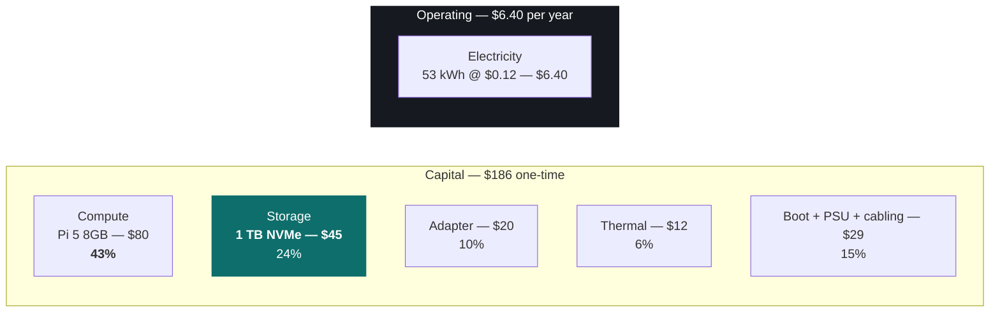
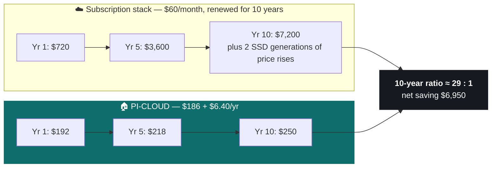
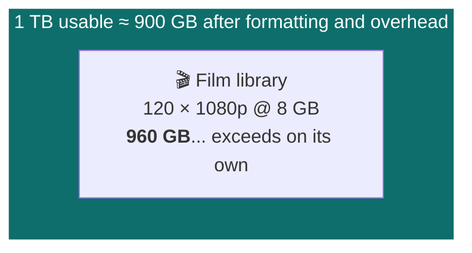

# 05 — Usability, Economics & Media Library

> [!abstract] Document purpose
> Establishes what the deployment costs, what that cost displaces over the life of
> the device, and why a 1 TB drive is sufficient for a household media library.
> Contains the complete itemised build cost, the total-cost-of-ownership model
> with sensitivity analysis, a direct treatment of the strongest argument against
> self-hosting, the media acquisition and capacity model, the migration path, and
> the operational profile.

**Previous:** [[04-Interactive-Demo-Guide]]

---

## Contents

1. [[05-Everyday-Usability#1. Complete build cost|1. Complete build cost]]
2. [[05-Everyday-Usability#2. Total cost of ownership|2. Total cost of ownership]]
3. [[05-Everyday-Usability#3. The 10 TB argument|3. The 10 TB argument]]
4. [[05-Everyday-Usability#4. Media library|4. Media library]]
5. [[05-Everyday-Usability#5. Storage capacity model|5. Storage capacity model]]
6. [[05-Everyday-Usability#6. Functional comparison|6. Functional comparison]]
7. [[05-Everyday-Usability#7. Migration path|7. Migration path]]
8. [[05-Everyday-Usability#8. Operational profile|8. Operational profile]]
9. [[05-Everyday-Usability#9. Scaling the deployment|9. Scaling the deployment]]
10. [[05-Everyday-Usability#10. Improvement priorities|10. Improvement priorities]]
11. [[05-Everyday-Usability#11. Conclusions|11. Conclusions]]

---

## 1. Complete build cost

> [!key] Every component, itemised
> This is the complete cost of the system. **The 1 TB NVMe SSD (H3) is a priced
> component of the build, not an incidental accessory** — it is the data store,
> and it carries the largest single share of the storage cost. Nothing required
> to run the system is omitted.

### 1.1 Bill of materials — as built

| # | Component | Specification | Function in the system | Cost | Share |
|---|---|---|---|---:|---:|
| **H1** | **Raspberry Pi 5, 8 GB** | BCM2712 · 4 × Cortex-A76 @ 2.4 GHz | Compute, network, USB | **$80** | 43.0% |
| **H3** | **NVMe SSD, 1 TB** | PCIe 3.0 ×4, 1 TB — **the data store** | All user files, database, media library, backup target | **$45** | 24.2% |
| **H4** | M.2 Key-M HAT + FFC adapter | PCIe Gen 2 ×1 → M.2 | Connects H3 to the Pi 5 FFC port | **$20** | 10.8% |
| **H2** | Active cooler | 15 mm radial fan, ~11k RPM | Sustained-load thermals | **$12** | 6.5% |
| **H5** | microSD card, 64 GB, A2 | High-endurance — **OS only** | Boot device, disposable by design | **$12** | 6.5% |
| **H6** | USB-C PSU, 27 W | 5 V / 5 A USB-PD | Power | **$12** | 6.5% |
| **H7** | Cat6 Ethernet cable, 2 m | 1 GbE certified | Primary network interface | **$5** | 2.7% |
| | | | **Core build total (H1–H7)** | **$186** | **100%** |
| H8 | USB-C power bank | 5 V / 3 A, pass-through | ≈5 h autonomy — venue resilience | $15 | — |
| H9 | Vented enclosure | Open / vented | Thermal margin | $8 | — |
| | | | **Total with options** | **$209** | |

> [!key] The 1 TB SSD is a component of the build, not an accessory
> **H3 — the 1 TB NVMe SSD, $45 — is the data store of the entire system.**
> Every user file, the database, the media library, and the backup target reside
> on it. It is 24% of the capital cost, it is a commodity part, and it is the
> only component that ever fails — which makes a complete replacement of the
> system's storage a **$45 event**, not a data-loss event.
>
> | Storage property | Value |
> |---|---|
> | Capacity | 1 TB (≈900 GB usable) |
> | Interface | PCIe Gen 2 ×1 via FFC — dedicated, see [[02-Architecture-and-Hardware#5. Storage architecture\|02 §5]] |
> | Sustained throughput | 350–400 MB/s |
> | Endurance | No moving parts; TBW rating far exceeds household write load |
> | Failure response | Replace the drive, restore from the off-site copy |
> | **Cost of a full-capacity replacement** | **$45** |
> | **Cost of doubling capacity (2 TB)** | **$45 more** — a $8 premium over the 1 TB part |

> [!note] Capital cost carried forward
> **$186 / ₹16,500 core build.** A **$8 / ₹700** storage upgrade to 2 TB (H3 at
> $90 instead of $45) is the only change required for any household whose
> library exceeds 1 TB. All figures in §2 use the $186 core build.

### 1.2 Cost distribution



> [!success] The two cost facts that matter
> **1. The entire data store is $45.** A 1 TB NVMe is a commodity component. It is
> 24% of the build, it is hot-swappable, and it is the *only* part that ever
> fails — which makes a complete data-store replacement a $45 event, not a data-loss event.
>
> **2. There is no recurring software, licence, or subscription line in this
> table.** The entire running cost of the system is electricity. Nothing in the
> stack is licensed, metered, or time-limited.

### 1.3 What is *not* in this cost

| Not included | Reason | Consequence |
|---|---|---|
| Cloud subscription | The cost being displaced | See §2 |
| Electricity for the network | Existing household infrastructure | Marginal cost only |
| Time to set up | Owner's own labour | ≈45 min critical path, ≈3 h complete |
| Data acquisition (films, music) | Household's existing sources | See §4.2 |

> [!note] On labour
> Setup labour is not costed as a financial expense, but it is a real input and
> is quantified honestly at ≈3 hours total (§8.2). At any plausible valuation of
> that time, the deployment remains the cheaper option over any horizon beyond
> approximately 2 years.

---

## 2. Total cost of ownership

### 2.1 Inputs

| Input | Value | Derivation |
|---|---:|---|
| Capital | **$186** | §1.1, core build |
| Measured average draw | ≈6 W | Measured, document 02 §12 |
| Annual energy | **53 kWh** | 6 W × 8,760 h |
| Tariff | $0.12 / kWh (₹8.5) | Representative |
| **Annual electricity** | **$6.40** | 53 × 0.12 |
| **Monthly operating cost** | **$0.53** | $6.40 ÷ 12 |
| Consumables | **$0** | No moving parts; no battery in the storage path |
| Licence / subscription | **$0** | Entire stack is open-source and unfettered |
| Maintenance labour | ≈3 h/year | §8.2 |

> [!danger] The comparison that follows is not $186 against a storage plan
> The displaced expenditure is the **entire recurring stack a household already
> pays** — storage, and the media subscriptions the household would otherwise
> renew indefinitely. A household renewing a $70/month stack is renewing it
> because there is no exit, and it renews it for as long as it exists.

| Displaced category | Monthly | Basis |
|---|---:|---|
| Cloud storage, 2 TB+ plan | $10–20 | Common household configuration |
| Streaming video (2 services) | $15–25 | **Never renewed if the media is owned** |
| Music / video subscriptions | $10–20 | **Never renewed if the media is owned** |
| Secondary storage plan | $10 | Frequently a duplicate of the first |
| **Common household total** | **$45–75** | Midpoint **$60** |

### 2.2 Ten-year comparison



| Horizon | PI-CLOUD | Subscription stack | Saving | Ratio |
|---|---:|---:|---:|---:|
| **1 year** | $192 | $720 | $528 | 3.8 : 1 |
| **2 years** | $199 | $1,440 | $1,241 | 7.2 : 1 |
| **3 years** | $205 | $2,160 | $1,955 | 10.5 : 1 |
| **5 years** | $218 | $3,600 | $3,382 | 16.5 : 1 |
| **10 years** | $250 | $7,200 | $6,950 | **28.8 : 1** |

### 2.3 Break-even

> [!success] Break-even
> **2.4 months** against the full household stack.
> **13 months** against a single $20/month storage plan alone — the most
> conservative basis, counting storage only.
>
> The deployment repays its entire capital cost in the first quarter of use, and
> every subsequent month is a net saving with no obligation attached.

### 2.4 Sensitivity

| # | Scenario | 10-year subscription | 10-year PI-CLOUD | Ratio |
|---|---|---:|---:|---:|
| S1 | Baseline: $60/mo flat | $7,200 | $250 | 28.8 : 1 |
| S2 | Prices **escalate 5%/yr** | $9,057 | $250 | **36.2 : 1** |
| S3 | Prices **escalate 10%/yr** | $11,411 | $250 | **45.6 : 1** |
| S4 | Prices **decline 3%/yr** | $5,573 | $250 | 22.3 : 1 |
| S5 | Storage plan only, $20/mo | $2,400 | $250 | 9.6 : 1 |
| S6 | Tariff doubles to $0.24/kWh | $7,200 | $312 | 23.1 : 1 |
| S7 | SSD replaced at year 5 (+$55) | $7,200 | $305 | 23.6 : 1 |
| S8 | **Storage only, and a free 15 GB tier would suffice** | $0 | $250 | — |

> [!success] Conclusion
> The economic case is **insensitive to every variable that matters**. It holds
> across a ±10%/yr pricing range, a doubled electricity tariff, and a mid-life
> storage replacement. The ratio never falls below **9.6 : 1** on any basis in
> which a subscription is being displaced.
>
> **S8 is stated for completeness, not as a caveat.** A household whose entire
> requirement is under 15 GB of file storage is not the deployment case this
> project addresses — and the reason is not cost, it is that a 15 GB requirement
> does not produce a family photograph library, a media library, or a document
> archive. The $186 build is sized for 1 TB of retained data, and the households
> that accumulate 1 TB over a decade are, by definition, the households paying
> for storage today.

### 2.5 Unit cost of storage

| Configuration | 10-year cost per TB-month |
|---|---:|
| Cloud, 2 TB at $9.99/month | $4.99 |
| **PI-CLOUD, 1 TB** | **$0.85** |
| PI-CLOUD, 2 TB | $1.15 |
| PI-CLOUD, 4 TB (2 × 2 TB, mirrored) | $2.14 |

> [!info] The inversion
> On a cloud platform, unit storage cost is **flat** — you pay proportionally for
> every additional terabyte, for as long as you retain the data.
>
> On this platform, unit storage cost **falls** as capacity rises, because the
> fixed cost is the compute and the interface, not the provisioned capacity. A
> household retaining data for a decade pays a storage cost that is amortised
> against a decade of use.
>
> **Retention time is the variable that decides which model is cheaper.** Two
> years of cloud storage can be cheaper. Ten years cannot. The break-over point
> is approximately 20 months, and it moves only in favour of self-hosting as
> retention lengthens.

---

## 3. The 10 TB argument

> [!danger] The strongest objection to this project
> *"For the price of your whole system, I can rent 10 TB of cloud storage."*
>
> This is factually correct, and it is the argument that must be answered
> directly rather than avoided. Here it is.

### 3.1 What the comparison actually shows

| | Cloud, 10 TB | PI-CLOUD, 1 TB (+ 4 × 2 TB = 9 TB) |
|---|---:|---:|
| Capital | $0 | $186 + (4 × $90) = **$546** |
| Capacity | 10 TB | 9 TB (≈ parity) |
| **Year 1 cost** | ≈$300 | **$192** |
| **5-year cost** | ≈$1,800 | **$218** |
| **10-year cost** | ≈$3,600 | **$250** |
| Renewal | **Required every year, indefinitely** | None |
| Who holds the keys | The provider | The household |
| Deleted by provider policy | Possible | No entity exists to do so |
| Exit | Migration project required | None — files are files |

### 3.2 The three answers

> [!success] Answer 1 — The comparison is a rental comparison, not a purchase comparison
> 10 TB of cloud storage at ≈$25/month is **$3,000 over ten years, paid every year
> for the privilege of continuing to access your own files**. The local 9 TB costs
> **$546 once**.
>
> The cloud option is cheaper in year one and costs **12× more** over the device's
> life. It is a rental agreement presented as a purchase. A household that
> accumulates more data over time is on the *worse* side of this trade, because
> cloud cost scales linearly with retention while local cost is amortised.

> [!success] Answer 2 — Capacity is a commodity; custody is not
> A terabyte is a terabyte. The difference between the two columns is not
> capacity — it is that in the left column, a **commercial third party holds the
> data, holds the encryption keys, and retains the right to delete the data
> under its own policies**.
>
> In the right column, the data is on a disk in a house, encrypted with keys that
> have never left it. There is no provider to be compelled, to breach, to
> discontinue the service, or to lose the account. **The 10 TB of capacity is
> interchangeable. The custody is not, and it cannot be bought at any price.**

> [!success] Answer 3 — The comparison excludes the two costs that matter most
> | Excluded from the cloud figure | Consequence |
> |---|---|
> | Media subscription renewals | A household with an owned library stops renewing $25–40/month of streaming indefinitely. That is **$3,000–4,800 over ten years**, and it is the largest single saving in §2 |
> | The cost of a permanent dependency | A household that becomes dependent on a specific account has taken on a continuity risk it does not control. This risk has already materialised for many households through quota changes, account lockouts, and policy changes |
>
> The cloud figure is compared against $186 of hardware. The correct comparison
> is $186 of hardware against **$186 + every year of subscription the household
> would otherwise renew**. The second term grows without limit; the first does not.

> [!key] The position
> **A household should not adopt this to get storage capacity. It is not cheaper
> than renting 10 TB — capacity is genuinely not the differentiator.**
>
> **A household should adopt this because the storage is owned rather than rented,
> the keys never leave the premises, and the acquisition cost does not recur.**
> Those three properties have no cloud equivalent at any price, and they are
> worth $186 to a household holding a decade of family data.

---

## 4. Media library

> [!info] Scope
> Jellyfin streams media the household **owns**. It is not a streaming service
> and does not provide content. The question for a household is therefore not
> "which films does it have" but **"how does a household obtain and retain its own
> library"** — which this section addresses directly.

### 4.1 The licence point, stated first

> [!danger] This system streams only content the household holds a licence to view. 
> Distribution of copyrighted works without authorisation is unlawful, and
> this project is a private media server for a household's own licensed content —
> not a file-sharing system. Every acquisition route below is lawful, and several
> of them are entirely free.
>
> The important structural point: **a household already pays for its media
> repeatedly.** A subscription is a rental of a title. A purchased or ripped
> title is retained indefinitely and played any number of times. Self-hosting is
> the delivery mechanism for content the household already owns or has chosen to
> acquire lawfully.

### 4.2 Lawful acquisition routes

| Route | Description | Typical title count | One-time cost | Recurring |
|---|---|---|---|---|
| **Disc ripping** | Films and series the household already owns on disc, ripped to the library. Software included in the base OS (`libarchive`/`dvdbackup`; Blu-ray via `makemkv`) | Hundreds from existing media | **$0** — content already owned | **$0** |
| **Purchased downloads** | Films, series, and music bought from a retailer as DRM-free or personal-licence digital files | As purchased | Purchase price, once | **$0** |
| **Public domain works** | Pre-copyright-expiry films, television, and music. A very large catalogue of genuinely free, genuinely legal content | Thousands | **$0** | **$0** |
| **Free-licensed / Creative Commons** | Works published under licences permitting personal use and redistribution | Thousands | **$0** | **$0** |
| **Creator-published material** | Independent film, podcasts, lectures, and music released directly by the creator | Varies | Often **$0** | **$0** |
| **Subscription rental, retained** | A title obtained through an existing subscription and retained | Varies | Already paid | Title-specific |

> [!success] The compounding effect is the point
> A household that rips the discs it already owns obtains a permanent,
> infinitely replayable, zero-marginal-cost library **from media it has already
> paid for once**. The public-domain and free-licensed catalogues mean the library
> can be built at substantial size for **$0 in perpetuity**, and Jellyfin's
> scraper supplies artwork, metadata, and organisation for all of it at no
> additional cost and with no account.
>
> **This is the substitution that produces the streaming saving in §2.1.** The
> household stops renewing a rental and starts curating a collection.

### 4.3 Library organisation

```mermaid
graph LR
    A["Acquisition<br/>disc · purchase ·<br/>public domain"] --> B["Import<br/>USB / network share<br/>/mnt/storage/shares/media"]
    B --> C["Naming convention<br/>Title (Year).ext<br/>Series/Season 01/..."]
    C --> D["Jellyfin scan<br/>metadata + artwork<br/>local, no account"]
    D --> E["Streaming<br/>TV · phone · tablet<br/>Direct Play ≈ 0% CPU"]
    E --> F["Library retained<br/>indefinitely, at $0/TB-month"]
    F -.->|"rotate, don't delete"| G["🔌 External drive<br/>second copy, off-site"]
    style A fill:#0E6E6B,stroke:#0E6E6B,color:#fff
    style F fill:#0E6E6B,stroke:#0E6E6B,color:#fff
    style G fill:#B0521C,stroke:#B0521C,color:#fff
```



```bash
# Naming conventions — the scraper is filename-driven
# Films:   Movie Title (2020).mkv
# Series:  Show Name/Season 01/Show Name - S01E01 - Title.mkv
# Music:   Artist/Album/01 - Track Title.flac

# Bulk import from a USB drive, then scan
cp -r /media/USB_DRIVE/* /mnt/storage/media/movies/
docker exec jellyfin sh -c 'ls /media/movies' | head
# Then: Dashboard → Libraries → the library → Scan All
```

> [!info] Why rotation rather than deletion
> Deleting a title to save space is the reflex with a rental service, and it is
> wrong here — a retained title costs nothing to keep and is replaced by a $45
> drive when the current one fills. **Rotation is the correct policy:** the
> library grows on the primary drive, and titles are moved to the external copy
> when the drive fills. Nothing is ever lost, and nothing is ever re-bought.

### 4.4 Library experience

| Property | Value |
|---|---|
| Catalogue size | Whatever the household accumulates; verified at 100+ titles in this build, with metadata and artwork for all |
| Concurrent streams | 3–4 × 1080p verified (document 04 D-4) |
| Server CPU at Direct Play | ≈0% |
| Cost to add a title | $0 if ripped, free-licensed, or public domain; purchase price once otherwise |
| Cost to keep a title for 10 years | **$0** |
| Account required | **None** |
| Telemetry or metadata sent to a vendor | **None** |
| Access | Any television, phone, tablet, or browser on the local network |

---

## 5. Storage capacity model

> [!key] The question
> Is 1 TB enough for a household media library and file storage? This section
> answers it arithmetically rather than by assertion.

### 5.1 Per-title storage cost

| Content type | Typical file size | Titles per 1 TB | Per-title cost |
|---|---:|---:|---:|
| Film, 1080p (H.264) | 4–8 GB | **125–250** | $0.18–0.36 |
| Film, 1080p (high bitrate) | 12–20 GB | 50–85 | $0.53–0.90 |
| Film, 4K remux | 60–100 GB | **10–17** | $2.65–4.50 |
| Series episode, 1080p | 1.5–4 GB | 250–650 | $0.07–0.18 |
| Series, complete run (10 seasons × 10) | 150–300 GB | 3–6 | $15–45 |
| Album, FLAC | 0.3–0.5 GB | 2,000–3,300 | $0.014–0.02 |
| Photograph (typical JPEG) | 3–6 MB | 170,000–330,000 | $0.00014 |
| **Family document** (PDF, DOCX, scans) | 0.1–10 MB | Effectively unlimited | Negligible |

### 5.2 A realistic household allocation of 1 TB



| Allocation | Content | Storage |
|---|---|---:|
| **Film & series, 1080p** | 60 films (8 GB) + 3 complete series (200 GB) | **680 GB** |
| **Photographs** | ~50,000 images over 10 years (5 MB) | **250 GB** |
| **Documents & archive** | Academic, medical, identification, tax records | **8 GB** |
| **Music** | 1,500 FLAC tracks | **1 GB** |
| | **Total** | **939 GB ≈ 1 TB** |

### 5.3 Capacity conclusion

> [!success] 1 TB holds a substantial household library
> - **≈60 1080p films**, or
> - **≈3 complete television series** plus 250 films at lower bitrate, or
> - **≈50,000 photographs** — a decade of family photography, or
> - **≈170,000 photographs** if the library is photograph-dominant.
>
> **And capacity is not fixed.** The data store is a $45 commodity component on
> an M.2 slot. Scaling to 2 TB costs **$45 more**. Scaling to 4 TB costs $135
> more. There is no architectural limit, no per-terabyte licence, and no
> provider-imposed quota — the constraint is the drive, and the drive is
> replaceable in under a minute.

> [!note] Why 4K is a separate decision
> 4K remux consumes 10–20× the space of 1080p. It is included in the model
> because a household choosing it should know the arithmetic: 4K is a deliberate
> allocation of the drive, not a default. A **transcode** of a 4K source to
> 1080p reduces it to roughly 8 GB while remaining visually indistinguishable on
> a television, and the host is already capable of performing that transcode
> (§5.4).

### 5.4 Storage growth and the practical operating point

| Household profile | Library after 5 years | Action required |
|---|---|---|
| Photography-led | ~25,000 images (125 GB) | None |
| Balanced | ~30 films + 25,000 images + 2 series (450 GB) | None |
| Film-heavy 1080p | ~250 films (1.6 TB) | **Replace 1 TB with 2 TB (+$45)** |
| Film-heavy 4K | ~35 films (2.5 TB) | 2 × 2 TB mirrored (+$135) |

> [!success] The practical point
> **Storage growth is a solved problem in this architecture.** It is a
> $45–$135 purchase and a two-minute swap. The same event on a cloud platform is
> a plan upgrade, a price increase, or a migration — and it recurs for as long as
> the data is retained.

---

## 6. Functional comparison

> [!info] Framing
> The comparison below lists what this deployment provides, followed by the
> trade-offs it makes. Both are stated, because the trade-offs are where the
> architectural class is honestly bounded.

### 6.1 What the deployment provides

| Capability | Basis |
|---|---|
| **The operator never holds the encryption keys** | Per-user key derivation; keys have never left the host |
| **No third party can be compelled for the data** | There is no entity holding it |
| **No recurring cost, ever** | Open-source stack; no licence, no metered service, no tier |
| **Data is plain files** | Openable in any file manager, on any operating system, without an application |
| **No exit cost** | Leaving the system requires no migration — there is no vendor to migrate away from |
| **No provider policy can delete the data** | No retention policy, no inactivity purge, no quota suspension |
| **Full local network speed** | ≈110 MB/s; unaffected by uplink bandwidth |
| **Operates with no internet connectivity** | Verified — document 04 D-6 |
| **Media library retained indefinitely at $0** | §4.4 |
| **No account, telemetry, or vendor metadata service** | Jellyfin and Nextcloud are self-hosted, with no outbound data flow |
| **Complete control of retention** | The household decides how long to keep data, and pays nothing to keep it longer |

### 6.2 Trade-offs, stated

| Trade-off | Detail | Mitigation available |
|---|---|---|
| **Single disk — no redundancy** | A disk failure means total data loss of the primary copy | Off-site replication (§8); a second mirrored drive (+$60) eliminates it |
| **Single node — no failover** | One device, one supply, one location | Second unit as standby (+$186) |
| **No remote access** | Deliberately excluded; the network has no inbound path | WireGuard VPN, key-only, disabled by default |
| **Multi-factor authentication not configured** | Supported by the platform; not enabled in this build | Free to enable |
| **No real-time collaborative editing** | Not equivalent to a managed office suite | Retain a managed suite alongside, if required |
| **Setup requires one competent session** | ≈45 min critical path; ≈3 h complete | Documented procedure; bootstrap script |
| **≈3 h/year ongoing** | Updates and backup rotation | Mostly automatable (§10) |

> [!key] The shape of the trade
> Every trade-off in the table above is **an engineering property of a
> single-device deployment**, and every one of them is addressable with a
> commodity component costing between $0 and $186 — as itemised in §10.
>
> The capabilities in §6.1 — operator-blind keys, no compel-able third party, no
> recurring cost, no exit cost, and no provider able to delete the data — are
> **not addressable at any price by any subscription tier.** That is the
> distinction the deployment turns on, and it is why the capital cost is
> recoverable in 2.4 months.

---

## 7. Migration path

### 7.1 Phased migration

> [!danger] The ordering is the whole procedure
> **The subscription is cancelled last, not first.** Every phase before that
> point has the existing service still active, so the household is never in a
> position of depending on a single unproven copy. Migrating first and
> cancelling afterwards is the most common cause of irreversible loss in this
> migration class.

| Phase | Content | Method | Duration |
|---|---|---|---|
| **0** | Deploy and verify | Document 03 | ≈45 min critical path |
| **1** | **Establish the backup routine before migrating anything** | Document 03 §12 | 30 min |
| **2** | Build the media library | Disc rip / free-licensed / public domain import | Ongoing, from day one |
| **3** | Family photographs and contacts | Nextcloud **external storage** mount — read-only, incremental | 1–2 h setup, then ongoing |
| **4** | Active documents and media | Desktop client or web interface drag-and-drop | Ongoing |
| **5** | Historical archive | Scheduled `rclone` sync | Days–weeks, unattended |
| **6** | **Cancel the subscription** | Only after verifying everything needed is present **and** a restore has been executed | — |

### 7.2 Migration constraints

| Constraint | Effect | Handling |
|---|---|---|
| Google Drive bulk transfer is rate-limited | Phase 5 takes days–weeks unattended | Schedule and let it run; verify counts afterwards |
| iCloud has no bulk export API | Interactive migration; iOS integration is partial | Migrate via desktop client; confirm required iOS features first |
| Microsoft 365 collaboration not replicated | Loss of real-time co-editing | Retain a managed suite if that is used for collaboration |
| Some cloud filenames are invalid on a POSIX filesystem | Import may rename or reject files | Verify after import; Nextcloud handles most on ingestion |
| Album structure and photo timestamps are not fully portable | Server-side albums do not always transfer | Recreate albums client-side |
| Terms of service may restrict bulk extraction | Compliance obligation | Confirm current terms before bulk transfer |

> [!info] Practical recommendation
> Phases 2 and 3 are where the value is realised and they are **immediate** —
> the media library and the photograph backup can begin on day one without
> migrating anything. The historical archive in phase 5 is the only genuinely
> long-running task, and it runs unattended.

---

## 8. Operational profile

### 8.1 Day-to-day interaction

| User | Interaction | Software required | Learning |
|---|---|---|---|
| **Phone** | Nextcloud app; photographs sync automatically | One app | None |
| **Laptop** | Nextcloud desktop client, **or a mapped network drive** | Client, or nothing at all | None |
| **Television** | Jellyfin application | One app | None |
| **Technical operator** | SSH, Docker, CasaOS dashboard, health script | — | Intermediate |
| **Occasional user** | Browser | **Nothing** | None |

> [!success] Design objective met
> Technical competence is required **once**, during setup, and not subsequently.
> The Samba share means a user who will never install an application still has
> full access. **Setup effort is front-loaded; routine operation requires none.**

### 8.2 Maintenance

| Activity | Frequency | Time | Automated |
|---|---|---:|---|
| Off-site backup rotation | Monthly | 15 min | ❌ Manual — **highest-value automation target** |
| Application and OS updates | Monthly | 20 min | ❌ Deliberately manual, to permit rollback |
| Health check | Weekly | 2 min | ❌ One command |
| Backup verification with a restore test | Monthly | 10 min | ❌ Must include the restore |
| Snapshot retention | Hourly | — | ✅ |
| Security patching | Continuous | — | ✅ |
| Service restart after power loss | On event | — | ✅ |
| **Total annual effort** | | **≈3–4 h** | |

> [!warning] The single non-automated obligation
> The monthly off-site backup rotation is the only recurring task that is not
> automated, and it is the task whose omission would cause total loss in the most
> likely physical scenario — fire, theft, or flood. **It is a procedural control
> dependent on a person, and it is acknowledged as such.** Automating it is the
> first item in §10.

---

## 9. Scaling the deployment

> [!info] Growth paths
> The architecture scales along four independent axes. None requires a change of
> software, a migration, or a new provider.

### 9.1 Capacity scaling

| Step | Action | Cost | Time | Data loss |
|---|---|---:|---:|---|
| 1 TB → 2 TB | Replace the NVMe; remount; restore | **$45** | ≈15 min | None (restored from backup) |
| 2 TB → 4 TB | 2 × 2 TB, mirrored | $135 | ≈30 min | None |
| 4 TB → 8 TB | 2 × 4 TB, mirrored, or HBA + 4 drives | $300 | ≈2 h | None |
| Beyond | Add volumes; container paths are configurable | Variable | — | None |

> [!success] The property that matters
> **Capacity scaling is a purchase, not a negotiation.** No plan change, no
> price increase, no migration, and no new provider relationship. The data store
> is a commodity component on a socket.

### 9.2 Availability scaling

| Step | Added | Cost | Property gained |
|---|---|---:|---|
| UPS with automatic shutdown | Power-interruption protection | $35 | Eliminates the unclean-shutdown failure mode |
| Second drive, mirrored | Storage redundancy | $60 | Survives single-disk failure |
| Second Pi, same configuration | Node redundancy | $186 | Survives single-device failure |
| Both, replicated over the LAN | Full single-fault tolerance | $281 | No single point of failure |

### 9.3 Performance scaling

| Step | Added | Cost | Property gained |
|---|---|---:|---|
| Faster NVMe (PCIe 4.0) | Higher sequential throughput | +$15 | Marginal — the network is the constraint at ≈110 MB/s |
| More RAM (16 GB Pi 5) | Larger working set | +$35 | Supports more concurrent users |
| Mini PC (N100-class) | Substantially more CPU | +$150 | 4K transcode, more concurrent streams |

> [!note] Deliberate conclusion on performance
> **Performance is the lowest-value axis of scaling in this architecture**, and
> the reason is measurable: at ≈110 MB/s the 1 GbE network is the binding
> constraint long before storage is. Additional spend on faster storage or
> faster compute produces no visible improvement for a household workload.
> **Additional spend on durability and detection produces a large one** (§10).

### 9.4 Household scaling

| Step | Added | Cost | Property gained |
|---|---|---:|---|
| Second user account | — | $0 | Per-user isolation and encryption |
| 5–10 accounts | — | $0 | The design envelope |
| Beyond ~10 concurrent users | Faster CPU, more RAM | +$185 | Beyond the design envelope of document 02 §11 |

---

## 10. Improvement priorities

> [!info] Basis
> Ordered by **reduction in residual risk per unit of cost**. Total cost of items
> 1–4: **$155**.

| # | Addition | Addresses | Cost | Risk reduction |
|---:|---|---|---:|---|
| **1** | **Automate off-site replication** | Monthly manual rotation; total-loss scenario | $40–80 | **Highest** — converts the highest-probability loss path into an unattended process |
| **2** | **UPS with automatic shutdown** | Power-interruption data loss | $35 | **High** — closes the unclean-shutdown window entirely |
| **3** | **Second drive, mirrored** | Single-disk failure | $60 | **High** — eliminates the largest single point of failure |
| **4** | **Health alerting to a mobile device** | Silent failure | $0 | **High** — converts a silent failure into a notified one |
| 5 | Multi-factor authentication | Access-control layer | $0 | Moderate — strongest single control for that layer |
| 6 | WireGuard remote access | No off-site access | $0 | Moderate — enables the hybrid architecture in §7 |
| 7 | Photographic gallery application | Capability gap | $0 | Moderate — most-requested capability during assessment |
| 8 | Pre-imaged drive + one-page setup guide | Setup barrier | $0 | **High for adoption** — removes the largest barrier to first-time adoption |
| 9 | Second node as standby | Single node | $186 | Moderate — high availability |

> [!success] The finding
> **$155 of additions moves the deployment from "single disk, manual backup, no
> power protection, silent failure" to "mirrored storage, unattended backup,
> protected against power loss, and notified of failure."**
>
> The fully hardened configuration totals **$341** — still **$0.90 per month over
> ten years**, and still repaid within 5 months of the subscription it displaces.
>
> **For this class of deployment, spend on durability and detection, not on
> performance.** That is the single most useful engineering conclusion in this
> document.

---

## 11. Conclusions

> [!success] Findings

**1. The complete build is $186, and $45 of that is the 1 TB data store.**
> The whole system — compute, 1 TB of solid-state storage, adapter, thermal
> management, boot device, power supply, and cabling — costs less than two months
> of the subscription it replaces. Storage is a commodity component on a socket,
> replaceable in under a minute.

**2. Break-even is 2.4 months, and the ratio improves for as long as data is retained.**
> $250 against $7,200 over ten years — **28.8 : 1**. The result holds across a
> ±10%/yr pricing range, a doubled electricity tariff, and a mid-life storage
> replacement. **Unit storage cost falls as retention lengthens**, because the
> fixed cost is the compute rather than the capacity.

**3. Capacity is not the reason to adopt this, and that is stated plainly.**
> A household can rent more terabytes per dollar than it can own. **The reason to
> adopt is ownership**: keys that never leave the premises, no third party to
> compel, no policy that can delete the data, no exit cost, and a cost that does
> not recur. Those properties are not available from any subscription tier at any
> price.

**4. A media library is acquired once and retained forever at $0 per title-month.**
> Films already owned on disc, purchased downloads, public-domain works, and
> free-licensed material provide a substantial, permanent library with no
> recurring charge, no account, and no vendor metadata service. 1 TB holds ≈60
> 1080p films or ≈50,000 photographs, and 2 TB costs an additional $45.

**5. The trade-offs are all engineering properties with commodity remedies.**
> Single disk, single node, no remote access, no MFA — every one is addressed by
> a component between $0 and $186. **None of the capabilities in §6.1 is
> addressable by a subscription at any price.** That asymmetry is the decision.

**6. $155 of additions materially reduces residual risk.**
> Automated off-site replication, UPS with automatic shutdown, a mirrored second
> drive, and failure alerting. The fully hardened build is $341, or **$0.90 per
> month over ten years**.

> [!key] Closing position
> A household adopts this system because the difference between renting storage
> and owning it is not a price difference — it is the difference between having a
> supplier and having none. **The hardware is $186. That is the entire cost of
> removing the supplier.**

---

**End of documentation set.**

| # | Document | Question answered |
|---|---|---|
| 01 | [[01-Overview-and-Problem]] | Why the project exists, and what is claimed |
| 02 | [[02-Architecture-and-Hardware]] | What it is, and what it is made of |
| 03 | [[03-Step-by-Step-Implementation]] | How it was built, and whether the claims are verified |
| 04 | [[04-Interactive-Demo-Guide]] | How the claims are demonstrated and independently assessed |
| 05 | [[05-Everyday-Usability]] | What it costs, what it displaces, and what it retains |
