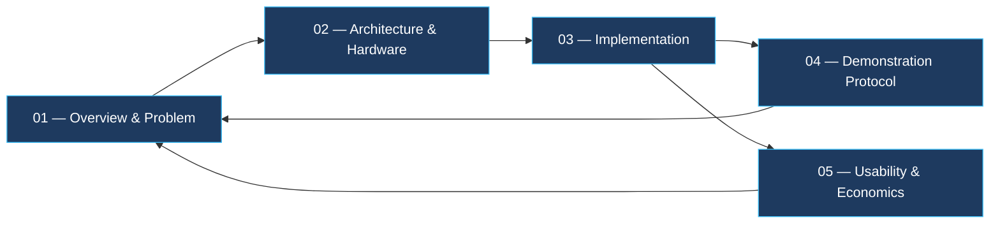

# PI-CLOUD — Annual Day Project Index

> [!abstract] Project summary
> Self-hosted private cloud on a Raspberry Pi 5, replacing consumer cloud
> subscriptions. **Capital: $186 / ₹16,500. Recurring: ≈$6 / ₹450 per year.**
> CasaOS + Nextcloud (per-user encryption) + Jellyfin + Samba, entirely on the
> local network, with no inbound internet exposure.

---

## Documentation set

| # | Document | Answers | Primary evidence |
|---|---|---|---|
| 01 | [[01-Overview-and-Problem]] | Why the project exists; requirements; risks | §8 criteria, §9 risk register |
| 02 | [[02-Architecture-and-Hardware]] | What it is; hardware, software, network, security model | Measured throughput, memory budget, port map |
| 03 | [[03-Step-by-Step-Implementation]] | How it was built; whether the claims are verified | **30-point checklist**, restore test, DR runbook |
| 04 | [[04-Interactive-Demo-Guide]] | How the claims are demonstrated and assessed | Demonstration sequence, evidence artefacts, verification sheet |
| 05 | [[05-Everyday-Usability]] | Is it worth deploying for a real household | TCO + sensitivity, functional trade-offs, adoption analysis |

---

## Headline figures

| Metric | Value | Verified by |
|---|---|---|
| Capital cost | $186 / ₹16,500 | 03 §5, 02 §2 |
| Recurring cost | ≈$6 / $0.50 per month | 02 §12 |
| Break-even | ≈2.8 months (full stack) / ≈10 months (storage only) | 05 §2.4 |
| Build time, critical path | ≈45 minutes | 03 Summary |
| OS failure recovery | ≈25 min, **no data loss** | 03 §14 DR-2 |
| Power | ≈6 W average, ≈53 kWh/year | 02 §12 |
| Concurrent users | 6 mixed workloads | 04 D-4 |
| Concurrent 1080p streams | 3–4 | 04 D-4 |
| Storage redundancy | **None — single disk** | 02 §11 |
| Inbound internet exposure | **None** | 02 §6.2, §10 |

---

## Where to start

| If you want to… | Go to |
|---|---|
| Understand the reasoning | [[01-Overview-and-Problem]] |
| Review the technical design | [[02-Architecture-and-Hardware]] |
| Reproduce the build | [[03-Step-by-Step-Implementation]] |
| Assess the system | [[04-Interactive-Demo-Guide#7. Independent verification sheet|04 §7 — verification sheet]] |
| Check the economics | [[05-Everyday-Usability#2. Total cost of ownership|05 §2]] |
| See the failures and limits | [[01-Overview-and-Problem#9. Risks & limitations\|01 §9]] and [[04-Interactive-Demo-Guide#10. Limitations to be disclosed\|04 §10]] |

---

> [!warning] Read the limitations
> [[01-Overview-and-Problem#9. Risks & limitations|01 §9]] and
> [[04-Interactive-Demo-Guide#10. Limitations to be disclosed|04 §10]] document
> 10 known limitations, of which the two material ones are **single-disk
> storage** and **no uninterruptible power supply**. Both are mitigated for
> ≈$95 total; see [[05-Everyday-Usability#10. Improvement priorities|05 §10]].
>
> The project is explicit about what it does not do. That is a deliberate
> property of the assessment, not an omission from it.
